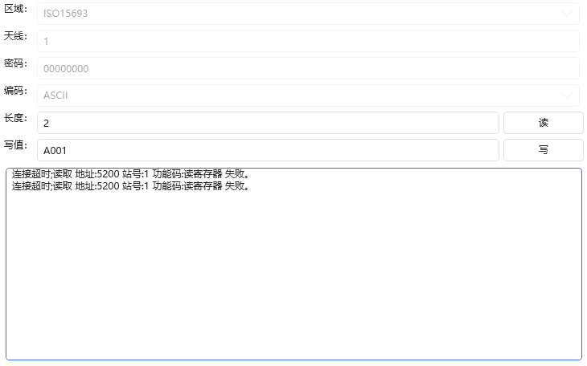

# Ping9719.IoT.WPF

### WPF界面
#这是对每种协议的界面实现，比如“Modbus”，那么在他的后面加入“View”就是“ModbusView（未做）”就是他的界面，方便快速的使用和调试。


# 安装包 [NuGet]
```CSharp
//等待稳定后发布，现在请自行拉取代码 
//After it stabilizes, it will be released. Now, please pull the code by yourself
Install-Package Ping9719.IoT.WPF
```

### 列子:[ensample code:]
```CSharp
//名称空间
xmlns:piIoT="https://github.com/ping9719/IoT"
//假如是Rfid，则为：RfidView
<piIoT:RfidView DeviceData="{Binding Dev1}" Area="ISO15693" IsReadPara="True" Encoding="ASCII" ReadCount="2" WriteVal="A001"/>
```
`RfidView`
