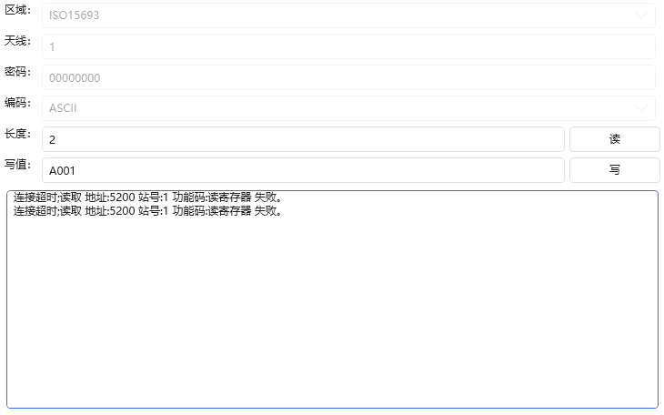

# Language Selection:
[简体中文](README.md) || [English](README_en-US.md)

# Table of Contents
- [Communication](#Communication)
    - [Client (ClientBase)](#ClientBase)
        - [1. Connection Mode (ConnectionMode)](#ConnectionMode)
        - [2. Receive Mode (ReceiveMode)](#ReceiveMode)
        - [3. Data Processor (IDataProcessor)](#IDataProcessor)
        - [4. Heartbeat](#Heartbeat)
    - [TcpClient](#TcpClient)
    - [TcpServer](#TcpServer)
    - [UdpClient](#UdpClient)
    - [SerialPortClient (Serial Port)](#SerialPortClient)
    - [UsbHidClient (USB)](#UsbHidClient)
    - [BleClient (Bluetooth)](#BleClient)
    - [HttpClient](#HttpClient)
    - [HttpServer](#HttpServer)
    - MqttClient (To be developed)
    - MqttServer (To be developed)
- [Modbus](#Modbus)
    - [ModbusRtuClient](#Modbus)
    - [ModbusTcpClient](#Modbus)
    - [ModbusAsciiClient](#Modbus)
- [PLC](#PLC)
    - [Type Comparison Table](#PlcType)
    - [Rockwell (AllenBradleyCipClient)](#AllenBradleyCipClient)
    - [Inovance (InovanceModbusTcpClient)](#InovanceModbusTcpClient)
    - [Mitsubishi (MitsubishiMcClient)](#MitsubishiMcClient)
    - [Omron (OmronFinsClient, OmronCipClient)](#OmronFinsClient)
    - [Siemens (SiemensS7Client)](#SiemensS7Client)
- [Robot](#Robot)
    - [Epson (EpsonRobot)](#Robot)
- [Algorithm](#Algorithm)
    - [Affine Transform (AffineTransform)](#AffineTransform)
    - [Average Point (AveragePoint)](#AveragePoint)
    - [CRC Check](#CRC)
    - [LRC Check](#LRC)
    - [Fourier Filter (FFTFilter)](#FFTFilter)
    - [Stable Marriage Matching (GaleShapleyAlgorithm)](#GaleShapleyAlgorithm)
    - [Linear Regression (LinearRegression)](#LinearRegression)
- [Devices and Instruments](#Device)
    - [Airtight Detection](#Airtight)
        - Cosmo Airtight Detector (CosmoAirtight)
    - [Laser Marking (Mark)](#Mark)
        - DaZhu Laser Marker (DaZhuMark)
        - HuaPu Laser Marker (HuaPuMark)
    - [RFID](#Rfid)
        - Pepperl+Fuchs RFID (BeiJiaFuRfid)
        - TaiHeSen RFID (TaiHeSenRfid)
        - WanQuan RFID (WanQuanRfid)
    - [Barcode Scanner (Scanner)](#Scanner)
        - Honeywell Scanner (HoneywellScanner)
        - Mindeo Scanner (MindeoScanner)
    - [Screwdriver (Screw)](#Screw)
        - MiLe Screwdriver (MiLeScrew)
    - [Welding Machine (Weld)](#Weld)
        - Quick Welding Machine (KuaiKeWeld)
    - [Other List](#EstsList)
- [Frequently Asked Questions](#Issue)
    - [1. How to use a custom protocol?](#UserProtocol)
    - [2. How to customize JSON parsing?](#UserJson)

# Communication <a id="Communication"></a>
Exchange information using specified methods.
## Client (ClientBase) <a id="ClientBase"></a>
`TcpClient` or `SerialPortClient` both implement `ClientBase`, and their usage is identical.

### 1. Connection Mode <a id="ConnectionMode"></a>

Three connection modes:
> 1. Manual (General scenarios). You need to open and close it yourself. This mode is more flexible.
> 2. Auto Open (Suitable for short connections). If Open() is not executed, it will automatically open and close for each send/receive, suitable for short connection scenarios. For temporary long connections, you can also call Open() and then Close().
> 3. Auto Reconnection (Suitable for long connections). After Open() is called, if a disconnection is detected, it will automatically attempt to reconnect, suitable for long connection scenarios. Calling Close() will stop reconnection.

Auto reconnection rules:
> 1. When disconnected, attempt to reconnect, first wait 1 second.
> 2. If unsuccessful, continue to increase the wait time by one second, up to the maximum reconnection time (`MaxReconnectionTime`).
> 3. Continue until reconnection succeeds, or the user manually calls Close(`Close()`).

Brief code:
```CSharp
var client1 = new TcpClient("127.0.0.1", 8080);
client1.ConnectionMode = ConnectionMode.Manual; // Manual, system default.
client1.ConnectionMode = ConnectionMode.AutoOpen; // Auto open.
client1.ConnectionMode = ConnectionMode.AutoReconnection; // Auto reconnection.
client1.MaxReconnectionTime = 10; // Maximum reconnection time, in seconds. Default is 10 seconds.
```

### 2. Receive Mode (ReceiveMode) <a id="ReceiveMode"></a>
Data reception introduction
There are two places in the client where data can be received: 1. the event `Received`, and 2. the methods `Receive()` or `SendReceive()`. The method has priority over the event; if the method receives data, the event will not receive it.
```CSharp
// Default mode in methods
client.ReceiveMode = ReceiveMode.ParseByteAll();
// Default mode in events
client.ReceiveModeReceived = ReceiveMode.ParseByteAll();
```
Received data is first separated into frames by the 'Receive Mode', then processed by the 'Data Processor'.
> Suppose the other party sends the strings "ab\r\n" and "cd\r\n" with a 100ms interval between them.
> Here "ab\r\n" is one frame, and "a" means one bit.
> Suppose there is 100ms between each frame, and 1ms between each bit.

| Code | Result | Description | Recommended Scenario |
| ------------------------------------ | --------- | ------------ | ------------ |
| `ReceiveMode.ParseByte(2)` | ab | Reads the specified number of bytes | When the communication protocol specifies a fixed frame length or when the remaining length to receive is known |
| `ReceiveMode.ParseByteAll()` | a or ab\r\n | Reads all immediately available bytes | When high efficiency is needed and nothing is known. TCP and other protocols generally have all information in one frame; serial port generally has one bit per frame |
| `ReceiveMode.ParseChar(1)` | a | Reads the specified number of characters | Same as `ParseByte()` |
| `ReceiveMode.ParseTime(10)` | ab\r\n | Reads until the specified time interval has passed without new messages | A compromise solution when nothing is known but you want complete information, at the cost of sacrificing the specified time, usually default for serial ports |
| `ReceiveMode.ParseToEnd("\r\n")` | ab\r\n | Reads until the specified information is reached | When the end of each frame is known |

### 3. Data Processor (IDataProcessor) <a id="IDataProcessor"></a>
Introduction
> 1. When sending data, the data can be uniformly processed before sending.
> 2. After receiving data, the data can be processed before being forwarded.
> 3. Multiple data processors can be stacked; the first added is processed first (so in some cases, the order of receiving processors should be the reverse of sending processors).

Built-in data processors <a id="IDataProcessorIn"></a>

| Name | Description |
| ----------- | -------------- |
| EndAddValueDataProcessor | Adds a fixed value to the end. For example, adding carriage return and line feed at the end |
| EndClearValueDataProcessor | Removes a fixed value from the end. For example, removing carriage return and line feed from the end |
| PadLeftDataProcessor | Adds a fixed value to the left (head) to reach the specified length. |
| PadRightDataProcessor | Adds a fixed value to the right (tail) to reach the specified length. |
| StartAddValueDataProcessor | Adds a fixed value to the beginning |
| StartClearValueDataProcessor | Removes a fixed value from the beginning |
| TrimDataProcessor | Removes specified matches from the beginning and end. |
| TrimEndDataProcessor | Removes specified matches from the end. |
| TrimStartDataProcessor | Removes specified matches from the beginning. |

Custom data processor
1. Your class only needs to implement the interface `IDataProcessor`, e.g.: `public class MyClass : IDataProcessor`.

2. Start using the custom data processor
```CSharp
client1.SendDataProcessors.Add(new MyClass());
client1.ReceivedDataProcessors.Add(new MyClass());
```

### 4. Heartbeat <a id="Heartbeat"></a>
Custom operation at specified intervals.
Note: Heartbeat does not take effect in `ConnectionMode.AutoOpen` mode.
```CSharp
// Heartbeat interval. Default is 5 seconds. Set to 0 to pause sending heartbeat
client1.HeartbeatTime = 5000;
// Send "1" each time and report heartbeat result.
client1.Heartbeat = (a) =>
{
    var aa = a.Send("1");
    return aa.IsSucceed;
};

client1.Open(); // Open, handle properties and events before opening
```

## TcpClient <a id="TcpClient"></a>
`TcpClient : ClientBase`
```CSharp
ClientBase client1 = new TcpClient("127.0.0.1", 502);
client1.Encoding = Encoding.UTF8;

//1: Connection mode. Auto-reconnection is commonly used.
client1.ConnectionMode = ConnectionMode.Manual; // Manual, system default. You need to open and close it yourself. This mode is more flexible.
client1.ConnectionMode = ConnectionMode.AutoOpen; // Auto open. If Open() is not executed, it will automatically open and close for each send/receive, suitable for short connection scenarios. For temporary long connections, you can also call Open() and then Close().
client1.ConnectionMode = ConnectionMode.AutoReconnection; // Auto reconnection. After Open() is called, if a disconnection is detected, it will automatically reopen, suitable for long connection scenarios. Calling Close() will stop reconnection.

//2: Receive mode. Handle packet sticking in the way you think is best.
client1.ReceiveMode = ReceiveMode.ParseByteAll();
client1.ReceiveModeReceived = ReceiveMode.ParseByteAll();

//3: Data processors. Can add line breaks when sending, remove them when receiving, or customize.
client1.SendDataProcessors.Add(new EndAddValueDataProcessor("\r\n", client1.Encoding));
client1.ReceivedDataProcessors.Add(new EndClearValueDataProcessor("\r\n", client1.Encoding));

//4: Event-driven.
client1.Opened = (a) => { Console.WriteLine("Connection successful."); };
client1.Closed = (a, b) => { Console.WriteLine($"Closed successfully. {(b ? "Manually disconnected" : "Automatically disconnected")}"); };
client1.Received = (a, b) => { Console.WriteLine($"Received message: {a.Encoding.GetString(b)}"); };

client1.Open(); // Open, handle properties and events before opening

//5: Simple send, receive, and send-receive operations.
client1.Send("abc"); // Send
client1.Receive(); // Receive
client1.Receive(3000); // Receive, 3-second timeout
client1.Receive(ReceiveMode.ParseToEnd("\n", 3000)); // Receive until "\n" string, 3-second timeout
client1.SendReceive("abc", 3000); // Send and wait for data, 3-second timeout
client1.SendReceive("abc", ReceiveMode.ParseToEnd("\n", 3000)); // Send and receive until "\n" string, 3-second timeout
```

## TcpServer <a id="TcpServer"></a>
`TcpServer : ServiceBase`
```CSharp
var service = new TcpService("127.0.0.1", 8005);
service.Encoding = Encoding.UTF8;
// Receive mode
service.ReceiveMode = ReceiveMode.ParseByteAll(); // Default mode for method "Receive()"
service.ReceiveModeReceived = ReceiveMode.ParseByteAll(); // Default mode for event "Received"
service.Opened = (a) =>
{
    Console.WriteLine($"Client [{(a as INetwork)?.Socket?.RemoteEndPoint}] connected successfully");
};
service.Closed = (a) =>
{
    Console.WriteLine($"Client closed successfully");
};
service.Received = (a, b) =>
{
    Console.WriteLine($"Client [{(a as INetwork)?.Socket?.RemoteEndPoint}] received message: " + a.Encoding.GetString(b));
};

// Open connection, all properties must be set before opening
service.Open();

if (service.Clients.Any())
{
    // Send information to the first client, usage is the same as 'TcpClient', no additional explanation
    service.Clients[0].Send("123");
}
```

## UdpClient <a id="UdpClient"></a>
`UdpClient : ClientBase`
```CSharp
// Remote send: 10.10.1.69:8001
// Local listen: 10.10.1.69:8002
var client = new UdpClient("10.10.1.69", 8001, 8002);
client.Encoding = Encoding.UTF8;
client.ConnectionMode = ConnectionMode.Manual; // Udp should not use auto-reconnection mode (AutoReconnection)

client.Opened = (a) => { Console.WriteLine("Connection successful."); };
client.Closed = (a, b) => { Console.WriteLine($"Closed successfully. {(b ? "Manually disconnected" : "Automatically disconnected")}"); };
client.Received = (a, b) =>
{
    Console.WriteLine($"Received from [{(a as INetwork)?.Socket?.RemoteEndPoint}] message: {a.Encoding.GetString(b)}");
};

client.Open(); // Open, handle properties and events before opening

client.Send("abc");
var info1 = client.Receive(3000); // Receive, 3-second timeout
var info2 = client.SendReceive("abc"); // Send and wait for receive

client.Close();
```

## SerialPortClient <a id="SerialPortClient"></a>
`SerialPortClient : ClientBase`
> Serial port is point-to-point transmission, so there is only `SerialPortClient` and no `SerialPortService`. Use two `SerialPortClient` instead.
```CSharp
var client1 = new SerialPortClient("COM1", 9600);

// The following are default initialization properties,可以不设置
client1.ConnectionMode = ConnectionMode.Manual; // Manual open, auto-reconnection for serial port is not very meaningful
client1.Encoding = Encoding.ASCII; // How to parse strings
client1.TimeOut = 3000; // Timeout
client1.ReceiveMode = ReceiveMode.ParseTime(); // Default mode for method "Receive()", serial port is better to receive data based on time
client1.ReceiveModeReceived = ReceiveMode.ParseTime(); // Default mode for event "Received"

// All events are the same as TcpClient, not repeated here

// Open connection, all properties must be set before opening
client1.Open();

// All send and receive operations are the same as TcpClient, not repeated here
```

## HttpClient <a id="HttpClient"></a>
`HttpClient : ClientBase`

1. Implemented using `System.Net.Sockets.TcpClient`, only available in NetStandard2.0+.
2. JSON parsing is customizable, refer to [How to customize JSON parsing?](#UserJson).

```CSharp
HttpClient.Default.Get<string>("http://www.baidu.com"); // http://www.baidu.com
HttpClient.Default.Get<string>(new string[] { "http://www.baidu.com", "s" }); // http://www.baidu.com/s
HttpClient.Default.Get<string>("http://www.baidu.com", new { a = 1, b = "ab" }); // http://www.baidu.com?a=1&b=ab
HttpClient.Default.Post<User>("http://www.baidu.com", new { id = 1 }, new { a = 1, b = "ab" }); // http://www.baidu.com?a=1&b=ab  body:{id:1}
```

## HttpServer <a id="HttpServer"></a>
`HttpServer : ServiceBase`

1. Implemented using `System.Net.HttpListener`, may require administrator privileges to run in some cases.

```CSharp
HttpService service = new HttpService(8090);
// Error handling (errors in Received will go here)
service.ReceivedException = (request, response, err) =>
{
    return "{\"info\":\"" + err.Message + "\"}";
};
// Handle client data
service.Received = (request, response, data) =>
{
    // Request
    var method = request.HttpMethod;
    var urlAbs = request.Url?.AbsolutePath;
    var urlQue = request.Url?.Query;
    // Response
    response.ContentType = "application/json";

    if (method == HttpMethod.Get.Method)
    {
        // Home page
        if (urlAbs == "/")
        {
            return "{\"info\":\"Welcome welcome\"}";
        }
        else if (urlAbs == "/a/b/c")
        {
            return "{\"info\":\"ok\"}";
        }
    }
    else if (method == HttpMethod.Post.Method)
    {

    }

    response.StatusCode = (int)HttpStatusCode.NotFound;
    return "{\"info\":\"Not Found\"}";
};
service.Open();
```

## UsbHidClient (USB) <a id="UsbHidClient"></a>
`UsbHidClient : ClientBase`

> Requires package `Ping9719.IoT.Hid`
> Get report information `UsbHidClient.GetReportDescriptor(UsbHidClient.GetNames[0])`
>> 1. Report Type: Input, Output, Feature
>> 2. Report ID: Usually in the frame header, default value is `0x00`. Can be handled using "Data Processors".
>> 3. Report Length: Required fixed length, usually padded with `0x00` at the end if insufficient (low speed 8, full speed 64, high speed 1024). Can be handled using "Data Processors".

```CSharp
var names = UsbHidClient.GetNames; // Get all Usb devices
var client = new UsbHidClient(names[0]); // Access the first device

// Use data processors to handle reports
{
    // Add report ID (actual need depends on documentation)
    client.SendDataProcessors.Add(new StartAddValueDataProcessor(0));
    // Add report length padding (actual need depends on documentation)
    client.SendDataProcessors.Add(new PadRightDataProcessor(64));
    // Clear report ID (actual need depends on documentation)
    client.ReceivedDataProcessors.Add(new StartClearValueDataProcessor(0));
    // Clear report length padding (actual need depends on documentation)
    client.ReceivedDataProcessors.Add(new TrimEndDataProcessor(0));
}
```

## BleClient (Bluetooth) <a id="BleClient"></a>
`UsbHidClient : ClientBase`

> Requires package `Ping9719.IoT.Hid`
```CSharp
var names = BleClient.GetNames; // Get all Bluetooth devices
var client = new BleClient(names[0]); // Access the first device
```

# Modbus <a id="Modbus"></a>
`ModbusRtuClient : IClientData`
`ModbusTcpClient : IClientData`
`ModbusAsciiClient : IClientData`

Modbus Rtu : `Station Number` + `Function Code` + `Address` + `Length` + `Check Code`
Modbus Tcp : `Message Number` + `0x0000` + `Subsequent Byte Length` + `Station Number` + `Function Code` + `Address` + `Length`

```CSharp
var client = new ModbusRtuClient("COM1", 9600, format: EndianFormat.ABCD);
var client = new ModbusRtuClient(new TcpClient("127.0.0.1", 502), format: EndianFormat.ABCD); // ModbusRtu protocol over TCP
var client = new ModbusTcpClient("127.0.0.1", 502, format: EndianFormat.ABCD);
var client = new ModbusTcpClient(new SerialPortClient("COM1", 9600), format: EndianFormat.ABCD); // ModbusTcp protocol over serial port
client.Client.ConnectionMode = ConnectionMode.AutoReconnection; // Auto-reconnection. Recommended for tcp, other two recommended for serial port
client.Client.Open(); // Open

client.Read<Int16>("100"); // Read register
client.Read<Int16>("100.1"); // Read bit in register, bit reading only supports single read, preferably uint16, int16
client.Read<Int16>("s=2;x=3;100"); // Read register, corresponding station number, function code, address
client.Read<bool>("100"); // Read coil
client.Read<bool>("100", 10); // Read multiple coils

client.Write<Int16>("100", 100); // Write register
client.Write<Int16>("100", 100, 110); // Write multiple registers

client.ReadString("100", 5, Encoding.ASCII); // Read string
client.ReadString("100", 5, null); // Read string, in hexadecimal mode
client.WriteString("500", "abcd", 10, Encoding.ASCII); // Write string, when count>0 and insufficient, automatically pad with 0X00 at the end
```

# PLC <a id="PLC"></a>
## Common PLC type comparison table <a id="PlcType"></a>
> Types marked with * are commonly used. Generally, unless otherwise specified, all are supported.

| C#</br>.Net | Siemens S7</br>SiemensS7 | Mitsubishi MC</br>MitsubishiMc | Omron Fins</br>OmronFins |Omron Cip</br>OmronCip |Inovance</br>Inovance |
| ----------- | ---------------------- | ----------------------- | ------------------------ | --------------------- | ---------------- |
| Bool        |Bool|||BOOL||
| Byte        |Byte|||BYTE||
| Float *     |Real|||REAL||
| Double *    |LReal|||LREAL||
| Int16 *     |Int|||INT||
| Int32 *     |DInt|||DINT||
| Int64 *     ||||LINT||
| UInt16 *    |Word|||UINT||
| UInt32 *    |DWord|||UDINT||
| UInt64 *    ||||ULINT||
| string      |String|||STRING||
| DateTime    |Date|||DATE_AND_TIME||
| TimeSpan    |Time|||||
| Char        |Char|||||

## Rockwell (AllenBradleyCipClient) <a id="AllenBradleyCipClient"></a>
`AllenBradleyCipClient : IClientData`

This protocol has been tested less at the moment. Please test before using in a production environment.
It has been found that some models can also use `OmronCipClient` as an alternative.
```CSharp
AllenBradleyCipClient client = new AllenBradleyCipClient("127.0.0.1");
client.Client.ConnectionMode = ConnectionMode.AutoReconnection; // Auto-reconnection
client.Client.Open(); // Open

client.Read<bool>("abc"); // Read
client.Write<bool>("abc", true); // Write
```

## Inovance (InovanceModbusTcpClient) <a id="InovanceModbusTcpClient"></a>
`InovanceModbusTcpClient : IClientData`
```CSharp
var client = new InovanceModbusTcpClient("127.0.0.1");
client.Client.ConnectionMode = ConnectionMode.AutoReconnection; // Auto-reconnection
client.Client.Open(); // Open

client.Read<bool>("M1"); // Read
client.Read<Int16>("D1", 5); // Read 5
client.Write<bool>("M1", true); // Write
client.Write<Int16>("D1", new Int16[] { 1, 2 }); // Write multiple
```

## Mitsubishi (MitsubishiMcClient) <a id="MitsubishiMcClient"></a>
`MitsubishiMcClient : IClientData`
Test coverage table

| Type | Single Read/Write | Batch Read/Write |
|--------------|------------------|---------------|
| bool | ✔️ | ✔️ (Internal loop) |
| short | ✔️ | ✔️ |
| int32 | ✔️ | ✔️ |
| float | ✔️ | ✔️ |
| double | ✔️ | ✔️ |
| string | ✔️ | ✔️ |

> Note: Bool array batch writing uses loop single-point writing, which is relatively slow.
>
> Also supports byte, sbyte, ushort, uint32, int64, uint64 types. Due to less frequent use, please test yourself.

```CSharp
var client = new MitsubishiMcClient(MitsubishiVersion.Qna_3E, "127.0.0.1");
client.Client.ConnectionMode = ConnectionMode.AutoReconnection; // Auto-reconnection
client.Client.Open(); // Open

client.Read<Int16>("W0"); // Read
client.Read<Int16>("W0", 5); // Read 5
client.Write<Int16>("W0", 10); // Write
client.Write<Int16>("W0", new Int16[] { 1, 2 }); // Write multiple
```

## Omron (OmronFinsClient) <a id="OmronFinsClient"></a>
`OmronFinsClient : IClientData`
```CSharp
OmronFinsClient client = new OmronFinsClient("127.0.0.1");
client.Client.ConnectionMode = ConnectionMode.AutoReconnection; // Auto-reconnection
client.Client.Open(); // Open

client.Read<Int16>("W0"); // Read
client.Read<Int16>("W0", 5); // Read 5
client.Write<Int16>("W0", 10); // Write
client.Write<Int16>("W0", new Int16[] { 1, 2 }); // Write multiple
```

## Omron (OmronCipClient)
`OmronCipClient : IClientData`
```CSharp
OmronCipClient client = new OmronCipClient("127.0.0.1");
client.Client.ConnectionMode = ConnectionMode.AutoReconnection; // Auto-reconnection
client.Client.Open(); // Open

// Read/Write
client.Read<bool>("abc"); // Read
client.Write<bool>("abc", true); // Write

// Read/Write multiple
client.Read<bool[]>("abc"); // Read
client.Read<bool[]>("abc", 5); // Read multiple, and take first 5
client.Write<bool[]>("abc", new bool[] { true, false }); // Write
```

## Siemens (SiemensS7Client) <a id="SiemensS7Client"></a>
`SiemensS7Client : IClientData`
```CSharp
var client = new SiemensS7Client(SiemensVersion.S7_1200, "127.0.0.1");
client.Client.ConnectionMode = ConnectionMode.AutoReconnection; // Auto-reconnection
client.Client.Open(); // Open

// Supports common types (int, float...)
client.Read<Int16>("BD100.0.0"); // Read
client.Write<Int16>("BD100.0.0", 10); // Write

// Supports special types (string, DateTime, TimeSpan, Char)
client.Read<DateTime>("BD100.0.0"); // Read
client.Write<DateTime>("BD100.0.0", DateTime.Now); // Write

// Supports very long reads and writes
client.Read<Int16>("BD100.0.0", 9999); // Continuously read 9999 data, takes about a hundred milliseconds
client.Write<Int16>("BD100.0.0", new Int16[] { 1, 2, 3 }); // Continuously write 9999 data, takes about a hundred milliseconds

// String explanation
client.Read<string>("BD100.0.0"); // PLC type must be string, only supports alphanumeric ASCII encoding
client.ReadString("BD100.0.0"); // PLC type must be WString, supports Chinese UTF16 encoding,
// Special PLC type: String[3]
client.ReadString("BD100.0.0", 3, Encoding.ASCII);
client.WriteString("BD100.0.0", "abc", 3, Encoding.ASCII);
```

# Robot <a id="Robot"></a>
## Epson (EpsonRobot)
`EpsonRobot : IClient`
```CSharp
EpsonRobot client = new EpsonRobot("127.0.0.1");
client.Client.ConnectionMode = ConnectionMode.AutoReconnection; // Auto-reconnection
client.Client.Open(); // Open

client.Start();
client.Pause();
```

# Algorithm <a id="Algorithm"></a>
## Affine Transform (AffineTransform) <a id="AffineTransform"></a>
Affine transform coordinate converter, can be used for bidirectional conversion between camera coordinates and robot coordinates
```CSharp
var converter = new AffineTransform();
// Add calibration coordinate pairs (camera coordinate xy + robot coordinate xy)
converter.AddCalibration(100, 150, 50, 75);
converter.AddCalibration(200, 250, 100, 125);
converter.AddCalibration(300, 350, 150, 175);
converter.AddCalibration(400, 450, 200, 225);
var isok = converter.Calibrate();
// Transform (camera coordinate => robot coordinate)
var p1 = converter.Transform(250, 300);
// Inverse transform (robot coordinate => camera coordinate)
var p2 = converter.TransformInverse(125, 150);
```

## Average Point (AveragePoint) <a id="AveragePoint"></a>
Usage scenarios:
1. Robot evenly places/takes scenarios
2. Servo evenly moves scenarios

> Suppose: known start is 2; end is 8; total 4 points
> 2--[?]--[?]--8
> 2--[4]--[6]--8
> Visibly, the second is 4, the third is 6

```CSharp
// Single group
// 2,4,6,8
var aaa1 = AveragePoint.Start(2, 8, 4);

// Multiple groups
// 1,2,3,4
// 2,4,6,8
var aaa2 = AveragePoint.Start("1,2", "4,8", 4);
```

## CRC <a id="CRC"></a>
Usage scenarios:
1. Protocol checks correctness scenarios

```CSharp
byte[] bytes = new byte[] { 1, 2 };
// CRC algorithm
var c1 = CRC.Crc8(bytes);
var c2 = CRC.Crc8Itu(bytes);
var c3 = CRC.Crc8Rohc(bytes);
var c4 = CRC.Crc16(bytes);
var c5 = CRC.Crc16Usb(bytes);
var c6 = CRC.Crc16Modbus(bytes);
var c7 = CRC.Crc32(bytes);
var c8 = CRC.Crc32Q(bytes);
var c9 = CRC.Crc32Sata(bytes);
// CRC verification
CRC.CheckCrc8(c1);
CRC.CheckCrc8Itu(c2);
CRC.CheckCrc8Rohc(c3);
CRC.CheckCrc16(c4);
CRC.CheckCrc16Usb(c5);
CRC.CheckCrc16Modbus(c6);
CRC.CheckCrc32(c7);
CRC.CheckCrc32Q(c8);
CRC.CheckCrc32Sata(c9);
```

## LRC <a id="LRC"></a>
Usage scenarios:
1. Protocol checks correctness scenarios

```CSharp
LRC.GetLRC(bytes);
LRC.CheckLRC(bytes);
```

## Fourier Filter (FFTFilter) <a id="FFTFilter"></a>
Fourier filter (auto parallel) 1M points take 430ms
```CSharp
double[] result1 = FFTFilterOptimized.FilterFFT(data, 0.005);    // Use default parallel count 6
double[] result2 = FFTFilterOptimized.FilterFFT(data, 0.005, 8); // Use 8 parallel tasks
double[] result3 = FFTFilterOptimized.FilterFFT(data, 0.005, 1); // Disable parallel calculation
```

## Stable Marriage Matching (GaleShapleyAlgorithm) <a id="GaleShapleyAlgorithm"></a>
Usage scenarios:
1. Pairing similar items scenarios

> Suppose preference relationships are as follows (the more preferred, the earlier):
> M0❤W1,W0<br/>M1❤W0,W1<br/>M2❤W0,W1,W2,W3,W4<br/>M3❤W3<br/>M4❤W3

```CSharp
// 1. All participants in pairing
var ms = new string[] { "M0", "M1", "M2", "M3", "M4", };
var ws = new string[] { "W0", "W1", "W2", "W3", "W4", };
// 2. Convert to items
var msi = ms.Select(o => new GaleShapleyItem<string>(o)).ToList();
var wsi = ms.Select(o => new GaleShapleyItem<string>(o)).ToList();
// 3. Configure preference list. Suppose liking relationships: (preference from high to low)
// M0❤W1,W0   M1❤W0,W1   M2❤W0,W1,W2,W3,W4   M3❤W3   M4❤W3
msi[0].Preferences = new List<GaleShapleyItem<string>>() { wsi[1], wsi[0] };
msi[1].Preferences = new List<GaleShapleyItem<string>>() { wsi[0], wsi[1] };
msi[2].Preferences = new List<GaleShapleyItem<string>>() { wsi[0], wsi[1], wsi[2], wsi[3], wsi[4] };
msi[3].Preferences = new List<GaleShapleyItem<string>>() { wsi[3] };
msi[4].Preferences = new List<GaleShapleyItem<string>>() { wsi[3] };
// 4. Start calculation
GaleShapleyAlgorithm.Run(msi);
// 5. Print results
foreach (var item in msi)
{
    // M0❤M1   M1❤M0   M2❤M2   M3❤M3   M4❤null
    Console.Write($"{item.Item}❤{(item.Match?.Item) ?? "null"}   ");
}
```

## Linear Regression (LinearRegression) <a id="LinearRegression"></a>
Usage scenarios:
1. Sensor (temperature, pressure, flow) output value conversion to real value
> Temperature sensor: voltage value (mV) → temperature (°C)
> Measured data: 10mV→25°C, 30mV→75°C, 50mV→125°C
> Predict data: 20mV→50°C

2. Predict future sales based on historical data
3. Impact of product price changes on sales
4. Relationship between health indicators and disease risk
etc....

```CSharp
var regression = LinearRegression.Fit("10,30,50", "25,75,125");
double result = regression.Project(20); // 50
```

# Devices and Instruments <a id="Device"></a>

Various instruments require long connections must open `dev1.Client.Open();` need auto-open please set `dev1.Client.ConnectionMode = ConnectionMode.AutoOpen;` The following examples do not repeat descriptions or settings related to the client, except for very important or inconsistent ones.

## Cosmo Airtight Detector (CosmoAirtight) <a id="CosmoAirtight"></a>
```CSharp
CosmoAirtight dev1 = new CosmoAirtight("COM1"); // Cosmo
```

## Laser Marking (Mark) <a id="Mark"></a>
```CSharp
DaZhuMark dev1 = new DaZhuMark("127.0.0.1"); // DaZhu
HuaPuMark dev2 = new HuaPuMark("127.0.0.1"); // HuaPu
```

## RFID <a id="Rfid"></a>
<details><summary style="padding:10px;border:1px solid silver;border-radius:4px;">🚀 C#</summary>
<div style="padding:5px;margin-top:8px;border:1px solid silver;border-radius:4px;">

```CSharp
BeiJiaFuRfid rfid1 = new BeiJiaFuRfid("127.0.0.1"); // Pepperl+Fuchs
DongJiRfid rfid2 = new DongJiRfid("127.0.0.1"); // DongJi
TaiHeSenRfid rfid3 = new TaiHeSenRfid("127.0.0.1"); // TaiHeSen
WanQuanRfid rfid4 = new WanQuanRfid("127.0.0.1"); // WanQuan

// WanQuan usage
rfid4.ReadString(RfidAddress.GetRfidAddressStr(RfidArea.ISO15693, null, 1), 2, EncodingEnum.ASCII.GetEncoding());
rfid4.WriteString(RfidAddress.GetRfidAddressStr(RfidArea.ISO15693, null, 1), "A001", 2, EncodingEnum.ASCII.GetEncoding());
```

</div></details>

<details><summary style="padding:10px;border:1px solid silver;border-radius:4px;">🖥️ WPF</summary>
<div style="padding:5px;margin-top:8px;border:1px solid silver;border-radius:4px;">

```CSharp
// Namespace
xmlns:piIoT="https://github.com/ping9719/IoT"
// If it's Rfid, then: RfidView
<piIoT:RfidView DeviceData="{Binding Dev1}" Area="ISO15693" IsReadPara="True" Encoding="ASCII" ReadCount="2" WriteVal="A001"/>
```


</div></details>

## Barcode Scanner (Scanner) <a id="Scanner"></a>
```CSharp
HoneywellScanner dev1 = new HoneywellScanner("127.0.0.1"); // Honeywell
MindeoScanner dev1 = new MindeoScanner("127.0.0.1"); // Mindeo
```

## Screwdriver (Screw) <a id="Screw"></a>
```CSharp
MiLeScrew dev1 = new MiLeScrew("127.0.0.1"); // MiLe
```

## Other List <a id="EstsList"></a>

| Object Name | Function | Recommendation (1-5) | WPF | Avalonia | |
| ----------- | ---------------------- | ----------------------- | ------------------------ | --------------------- | ---------------- |
| KuaiKeDeskScrew | Quick Desktop Screwdriver | 2 ||||
| KuaiKeScrew | Quick Screwdriver | 2 ||||
| KuaiKeTcpScrew | Quick Electric Screwdriver | 2 ||||
| KuaiKeTemperatureControl | Quick Temperature Control | 2 ||||
| KuaiKeWeld | Quick Welding | 3 ||||

# Frequently Asked Questions <a id="Issue"></a>
## 1. How to use a custom protocol? <a id="UserProtocol"></a>
```CSharp
// XXX protocol implementation
public class XXX
{
    public ClientBase Client { get; private set; } // Communication pipeline

    public XXX(ClientBase client)
    {
        Client = client;
        // Client.ReceiveMode = ReceiveMode.ParseTime();
        Client.Encoding = Encoding.ASCII;
        // Client.ConnectionMode = ConnectionMode.AutoOpen;
    }

    // Default uses TcpClient
    public XXX(string ip, int port = 1500) : this(new TcpClient(ip, port)) { }
    // Default uses SerialPortClient
    //public XXX(string portName, int baudRate = 9600, Parity parity = Parity.None, int dataBits = 8, StopBits stopBits = StopBits.One, Handshake handshake = Handshake.None) : this(new SerialPortClient(portName, baudRate, parity, dataBits, stopBits, handshake)) { }

    // This is an example, it sends "info1\r\n" and waits for the returned string result
    public IoTResult ReadXXX()
    {
        string comm = $"info1\r\n";
        try
        {
            return Client.SendReceive(comm);
        }
        catch (Exception ex)
        {
            return IoTResult.Create().AddError(ex);
        }
    }

}

// Usage
var client = new XXX("127.0.0.1");
client.Client.ConnectionMode = ConnectionMode.AutoReconnection; // Auto-reconnection
client.Client.Open();

var info = client.ReadXXX();
```

## 2. How to customize JSON parsing? <a id="UserJson"></a>
1. JSON parsing prioritizes user-defined
2. In `NET8`, uses `System.Text.Json`
3. In non-`NET8`, uses `System.Runtime.Serialization.Json`

Therefore, in non-`NET8`, it is recommended to customize JSON parsing:
```CSharp
// Custom JSON parsing
public class MyJsonParse : IJsonParse
{
    public T DeserializeObject<T>(string json) => Newtonsoft.Json.JsonConvert.DeserializeObject<T>(json);
    public string SerializeObject(object obj) => Newtonsoft.Json.JsonConvert.SerializeObject(obj);
}

// Use custom JSON parsing, write in Main method
JsonParse.UseJsonParse = new MyJsonParse();
```