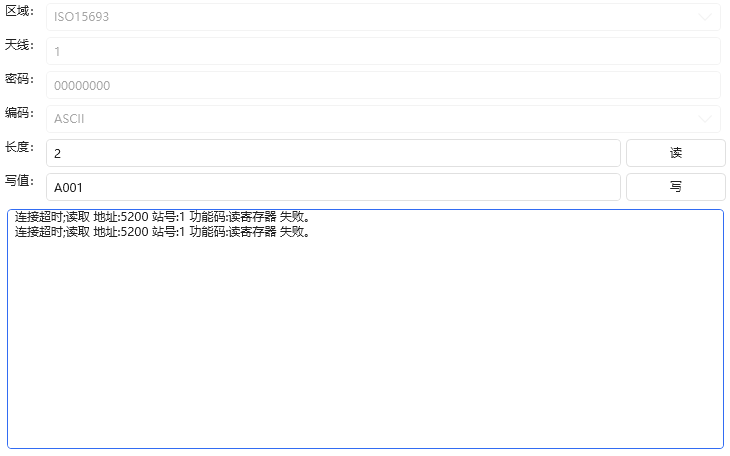

# Language:
[简体中文](README.md) || [English](README_en-US.md)

# Table of Contents
- [ByteData](#ByteData)
    - [Built-in Converters](#IByteConverter)
    - [Custom Converters](#IByteConverter0)
- [Communication](#Communication)
    - [ClientBase](#ClientBase)
        - [1. ConnectionMode](#ConnectionMode)
        - [2. ReceiveMode](#ReceiveMode)
        - [3. IDataProcessor](#IDataProcessor)
        - [4. Heartbeat](#Heartbeat)
    - [TcpClient](#TcpClient)
    - [TcpServer](#TcpServer)
    - [UdpClient](#UdpClient)
    - [SerialPortClient ; SerialClient (Serial Port)](#SerialPortClient)
    - [UsbHidClient (USB)](#UsbHidClient)
    - [BleClient (Bluetooth)](#BleClient)
    - [HttpClient](#HttpClient)
    - [HttpServer](#HttpServer)
- [Modbus](#Modbus)
    - [ModbusRtuClient](#Modbus)
    - [ModbusTcpClient](#Modbus)
    - [ModbusAsciiClient](#Modbus)
- [PLC](#PLC)
    - [Type Comparison Table](#PlcType)
    - [Rockwell (AllenBradleyCipClient)](#AllenBradleyCipClient)   
    - [Keyence (KeyenceHostLinkClient)](#KeyenceHostLinkClient)   
    - [Inovance (InovanceModbusTcpClient)](#InovanceModbusTcpClient)
    - [Mitsubishi (MitsubishiMcClient)](#MitsubishiMcClient)
    - [Omron (OmronFinsClient, OmronCipClient)](#OmronFinsClient)
    - [Siemens (SiemensS7Client)](#SiemensS7Client)
- [Robot](#Robot)
    - [Epson (EpsonRobot)](#Robot) 
- [Algorithm](#Algorithm)
    - [AffineTransform](#AffineTransform)
    - [AveragePoint](#AveragePoint)
    - [CRC](#CRC)
    - [LRC](#LRC)
    - [FFTFilter](#FFTFilter) 
    - [GaleShapleyAlgorithm](#GaleShapleyAlgorithm)   
    - [LinearRegression](#LinearRegression)
- [Devices and Instruments](#Device)
    - [Airtight Test (Airtight)](#Airtight)
        - Cosmo Airtight (CosmoAirtight)
    - [Laser Marking (Mark)](#Mark)
        - DaZhu Mark (DaZhuMark)
        - HuaPu Mark (HuaPuMark)
    - [RFID (Rfid)](#Rfid)
        - BeiJiaFu RFID (BeiJiaFuRfid)
        - TaiHeSen RFID (TaiHeSenRfid)
        - WanQuan RFID (WanQuanRfid)
    - [Barcode Scanner (Scanner)](#Scanner)
        - Honeywell Scanner (HoneywellScanner)
        - Mindeo Scanner (MindeoScanner)
    - [Screw Machine (Screw)](#Screw)
        - MiLe Screw Machine (MiLeScrew)
    - [Welding Machine (Weld)](#Weld)
        - KuaiKe Welding Machine (KuaiKeWeld)
        - JBC Welding Machine (JBCWeld)
    - [Other List](#EstsList)
- [FAQ](#Issue)
    - [1. How to use a custom protocol?](#UserProtocol)
    - [2. How to customize Json parsing?](#UserJson)

# ByteData `beta` <a id="ByteData"></a> 
> Note: The ByteData feature is in `beta` and may undergo significant changes.

A tool for converting between byte arrays (`byte[]`) and various data (numbers, classes, arrays, etc.). For example, it can parse raw PLC messages in batches and significantly improve efficiency.   
```CSharp
public class test
{
    public Int16 aa { get; set; }
    public Int16 bb { get; set; }

    [IoT(IsIgnore = true)]
    public Int16 cc { get; set; }
}

var testArr = new byte[] { 0, 1, 0, 2, 0, 3, 0, 4 };

// Add a custom converter (if needed)
Dictionary<Type, IByteConverter> converterDict = new Dictionary<Type, IByteConverter>()
{
    { typeof(bool), new BoolBitByteConverter()}
};

// Parse a single value
var int16 = ByteData.GetValue<Int16>(testArr, EndianFormat.ABCD, converterDict);//1
var obj = ByteData.GetValue<test>(testArr, EndianFormat.ABCD, converterDict);//{"aa":1,"bb":2,"cc":0}
// Parse all
var int16s = ByteData.GetValue<Int16[]>(testArr, EndianFormat.ABCD, converterDict);//[1,2,3,4]
var objs = ByteData.GetValue<test[]>(testArr, EndianFormat.ABCD, converterDict);//[{"aa":1,"bb":2,"cc":0},{"aa":3,"bb":4,"cc":0}]
// Parse a specified count
var int16ss = ByteData.GetValues<Int16>(testArr, 2, EndianFormat.ABCD, converterDict);//[1,2]
var objss = ByteData.GetValues<test>(testArr, 2, EndianFormat.ABCD, converterDict);//[{"aa":1,"bb":2,"cc":0},{"aa":3,"bb":4,"cc":0}]
// Reverse conversion
var bs = ByteData.ToBytes(obj, EndianFormat.ABCD);//[0,1,0,2]

// Special case (1 byte = 8 bools)
var bools = ByteData.GetValues<bool>(testArr, 1, EndianFormat.ABCD, converterDict);//[F,F,F,F,F,F,F,F]
```

Example usage in PLC:
```CSharp
var client = new SiemensS7Client(SiemensVersion.S7_1200, "127.0.0.1");
var plcdata = client.Read<byte>("BD100.0.0", 100);// Read 100 raw data items

ByteData byteD = new ByteData(plcdata.Value, client.Format);
var v1 = byteD.GetValue<Int16>(0);// Read the 1st data item
var v2 = byteD.GetValue<Int16>(2);// Read the 2nd data item
var v3 = byteD.GetValue<Int16>(4);// Read the 3rd data item
```

# Built-in Converters <a id="IByteConverter"></a>
Built-in converters are divided into "basic" and "special". Basic ones are included when `ByteData` is initialized. Special ones are not included; you can add them via `byteData.ByteConverterDict.Add(typeof(Int16), new Int16ByteConverter())`.   

> Basic

| Name | Description   | 
| ----------------  | --------- |
| ByteByteConverter |  Byte |
| SByteByteConverter | SByte  |
| Int16ByteConverter | Int16  |
| UInt16ByteConverter |UInt16   |
| Int32ByteConverter | Int32  |
| UInt32ByteConverter | UInt32  |
| Int64ByteConverter | Int64  |
| UInt64ByteConverter |UInt64   |
| SingleByteConverter | Single  |
| DoubleByteConverter | Double  |

> Special

| Name | Description   | 
| ----------------------- | --------- |
| BoolByteConverter | 1 byte = 1 bool |
| BoolBitByteConverter | 1 byte = 8 bools |
| StringByteConverter | String converter; if Encoding is null, uses a hexadecimal string |

# Custom Converters <a id="IByteConverter0"></a>
Your class needs to implement the `IByteConverter` interface.   
```CSharp
// Example: Int16 converter
public class Int16ByteConverter : IByteConverter
{
    public int ByteLength => 2;
    public object ToObject(IEnumerable<byte> bytes, EndianFormat format) => BitConverter.ToInt16(DataConvert.EndianToNet(bytes, format, 0, ByteLength), 0);
    public byte[] ToBytes(object data, EndianFormat format) => DataConvert.EndianToNet(BitConverter.GetBytes((short)data), format);
}
```
Usage:
```CSharp
var testArr = new byte[] { 0, 1, 0, 2, 0, 3, 0, 4 };
ByteData byteData = new ByteData(testArr, EndianFormat.CDAB);
// Add a custom converter (if needed)
byteData.ByteConverterDict.Add(typeof(Int16), new Int16ByteConverter());
```

# Communication <a id="Communication"></a>
Use the specified method to exchange information.
## ClientBase <a id="ClientBase"></a>
`TcpClient` or `SerialPortClient` both implement `ClientBase`, and their usage is the same.

### 1. ConnectionMode <a id="ConnectionMode"></a>    

Three connection modes:   
> 1. Manual (general scenario). You need to open and close it yourself; this method is more flexible.     
2. AutoOpen (suitable for short connections). If `Open()` is not called, each send and receive automatically opens and closes. This is suitable for scenarios requiring short connections. If a temporary long connection is needed, you can also call `Open()` and then `Close()`.    
3. AutoReconnection (suitable for long connections). After `Open()` is called, if a disconnection is detected, it automatically attempts to reconnect. This is suitable for scenarios requiring long connections. Calling `Close()` will stop reconnecting.   

Auto-reconnection rules:   
> 1. When disconnected, attempt to reconnect; the first attempt waits 1 second.   
> 2. If unsuccessful, continue increasing the wait time by one second until reaching the maximum reconnection time (`MaxReconnectionTime`).   
> 3. Until reconnection succeeds, or the user manually calls close (`Close()`).   

Connection mode example:  
```CSharp
var client1 = new TcpClient("127.0.0.1", 8080);
client1.ConnectionMode = ConnectionMode.Manual;// Manual, system default.
client1.ConnectionMode = ConnectionMode.AutoOpen;// Auto open.
client1.ConnectionMode = ConnectionMode.AutoReconnection;// Auto reconnection.
client1.MaxReconnectionTime = 10;// Maximum reconnection time, in seconds. Default is 10 seconds.
```

Advanced (using `IsAutoClose` to send or receive messages):  
> `IsAutoClose` defaults to true. It only takes effect when the mode is `AutoOpen`.   
Use case: When you need to send or receive messages continuously over a short connection or when the connection situation is unknown.
```CSharp
client1.ConnectionMode = ConnectionMode.AutoOpen;

// Without IsAutoClose
client.SendReceive("1/3"); // Open→send→receive→close
client.SendReceive("2/3"); // Open→send→receive→close
client.SendReceive("3/3"); // Open→send→receive→close

// With IsAutoClose
client.IsAutoClose = false;
client.SendReceive("1/3"); // Open→send→receive
client.SendReceive("2/3"); // send→receive
client.IsAutoClose = true;
client.SendReceive("3/3"); // send→receive→close
```

### 2. ReceiveMode <a id="ReceiveMode"></a>
Data reception introduction
In the client, there are 2 places where data can be received: 1 is the `Received` event, and 2 is the `Receive()` or `SendReceive()` method. The method has higher priority than the event. If the method receives data, the event will no longer receive it.
```CSharp
// Default mode in methods
client.ReceiveMode = ReceiveMode.ParseByteAll();
// Default mode in events
client.ReceiveModeReceived = ReceiveMode.ParseByteAll();
```
Received data is first split into frames by the "receive mode", and then processed by the "data processor".   
> Suppose the other party sends you the strings "ab\r\n" and "cd\r\n", with an interval of 100 milliseconds between them.   
> Here, "ab\r\n" is one frame, and "a" means one unit.    
> Suppose each frame is 100 ms apart, and each unit is 1 ms apart.    

| Code                                 | Result      | Description | Recommended Scenario | 
| ------------------------------------ | --------- |------------ | ------------ | 
| `ReceiveMode.ParseByte(2)`           | ab        | Read the specified number of bytes | When the communication protocol already specifies that a frame has a fixed length, or the remaining receive length is known | 
| `ReceiveMode.ParseByteAll()`         | a or ab\r\n | Read all immediately available bytes | When high efficiency is needed and nothing is known. For protocols such as TCP, one frame is usually all information; for serial ports, one frame is usually one unit of information | 
| `ReceiveMode.ParseChar(1)`         | a         | Read the specified number of characters | Same as `ParseByte()` | 
| `ReceiveMode.ParseTime(10)`          | ab\r\n    | Read until no new message arrives after the specified time interval | A compromise when nothing is known but complete information is desired; the cost is the specified time. Generally the default for serial ports | 
| `ReceiveMode.ParseToEnd("\r\n")` | ab\r\n    | Read until the specified information is encountered | When the end of each frame is known | 

### 3. IDataProcessor <a id="IDataProcessor"></a>
Introduction  
> 1. When sending data, data can be uniformly processed before sending </br>
> 2. After receiving data, data can be processed before forwarding  </br>
> 3. Multiple data processors can be stacked; the first added is processed first (so in some cases, received processors should be in reverse order of sent processors).

Built-in data processors  <a id="IDataProcessorIn"></a>

| Name | Description |
| ----------- | -------------- |
| EndAddValueDataProcessor   | Add a fixed value to the end. For example, add carriage return and line feed at the end |
| EndClearValueDataProcessor | Remove a fixed value from the end. For example, remove carriage return and line feed from the end |
| PadLeftDataProcessor   | Add a fixed value to the left (head) to reach the specified length. |
| PadRightDataProcessor | Add a fixed value to the right (tail) to reach the specified length. |
| StartAddValueDataProcessor   | Add a fixed value to the beginning |
| StartClearValueDataProcessor | Remove a fixed value from the beginning |
| TrimDataProcessor   | Remove specified matching items from both front and back. |
| TrimEndDataProcessor   | Remove specified matching items from the end. |
| TrimStartDataProcessor | Remove specified matching items from the beginning. |

Custom data processors   
1. Just implement the `IDataProcessor` interface, for example: `public class MyCalss : IDataProcessor`.   

2. Start using a custom data processor
```CSharp
client1.SendDataProcessors.Add(new MyCalss());
client1.ReceivedDataProcessors.Add(new MyCalss());
```
### 4. Heartbeat <a id="Heartbeat"></a>
> Note: Heartbeat does not take effect in `ConnectionMode.AutoOpen` mode.

Heartbeats are divided into active heartbeat and passive heartbeat.  

Active heartbeat: active send (loop) - receive => ok   
```CSharp
client1.HeartbeatTime = 5000;// Interval. Set to 0 to pause sending heartbeats
// Each time sends "1" and reports the heartbeat result.
client1.Heartbeat = (a) =>
{
    var aa = a.Send("1");
    return aa.IsSucceed;
};

client1.Open();// Open; process properties and events before opening
```
Passive heartbeat: passive receive => ok  
```CSharp
client1.HeartbeatReceiveTime = 5000;// Detection interval.
client1.Open();// Open; process properties and events before opening
```

## TcpClient <a id="TcpClient"></a>
`TcpClient : ClientBase`
```CSharp
ClientBase client1 = new TcpClient("127.0.0.1", 502);
client1.Encoding = Encoding.UTF8;

//1: Connection mode. Auto-reconnection is used more often
client1.ConnectionMode = ConnectionMode.Manual;// Manual, system default. You need to open and close it yourself; this method is more flexible.
client1.ConnectionMode = ConnectionMode.AutoOpen;// Auto open. If Open() is not called, each send and receive automatically opens and closes. Suitable for short connection scenarios. If a temporary long connection is needed, you can also call Open() then Close().
client1.ConnectionMode = ConnectionMode.AutoReconnection;// Auto reconnection. After Open() is called, if disconnection is detected, it automatically opens. Suitable for long connection scenarios. Calling Close() will stop reconnecting.

//2: Receive mode. Handle sticky packets in the way you think is best
client1.ReceiveMode = ReceiveMode.ParseByteAll();
client1.ReceiveModeReceived = ReceiveMode.ParseByteAll();

//3: Data processors. Can add a newline when sending and remove it when receiving; can also be customized
client1.SendDataProcessors.Add(new EndAddValueDataProcessor("\r\n", client1.Encoding));
client1.ReceivedDataProcessors.Add(new EndClearValueDataProcessor("\r\n", client1.Encoding));

//4: Event-driven.
client1.Opened += (a) => { Console.WriteLine("Connection succeeded."); };
client1.Closed += (a, b) => { Console.WriteLine($"Closed successfully. Close code: {b}"); };
client1.Received += (a, b) => { Console.WriteLine($"Message received: {a.Encoding.GetString(b)}"); };

client1.Open();// Open; process properties and events before opening

//5: Simple send, receive, and send-wait operations. 
client1.Send("abc");// Send
client1.Receive();// Receive
client1.Receive(3000);// Receive, 3-second timeout
client1.Receive(ReceiveMode.ParseToEnd("\n", 3000));// Receive until the \n string ending, timeout 3 seconds 
client1.SendReceive("abc", 3000);// Send and wait to receive data, 3-second timeout
client1.SendReceive("abc", ReceiveMode.ParseToEnd("\n", 3000));// Send and receive until the \n string ending, timeout 3 seconds 
```

## TcpServer   <a id="TcpServer"></a>   
`TcpServer : ServiceBase`
```CSharp
var service = new TcpService("127.0.0.1", 8005);
service.Encoding = Encoding.UTF8;
// Receive mode
service.ReceiveMode = ReceiveMode.ParseByteAll();// Default mode for method `Receive()`
service.ReceiveModeReceived = ReceiveMode.ParseByteAll();// Default mode for event `Received`
service.Opened += (a) =>
{
    Console.WriteLine($"Client[{(a as INetwork)?.Socket?.RemoteEndPoint}] connected successfully");
};
service.Closed += (a, b) =>
{
    Console.WriteLine($"Client[{(a as INetwork)?.Socket?.RemoteEndPoint}] closed successfully, close code: {b}");
};
service.Received += (a, b) =>
{
    Console.WriteLine($"Client[{(a as INetwork)?.Socket?.RemoteEndPoint}] message received: " + a.Encoding.GetString(b));
};

// Open connection; all properties must be set before opening
service.Open();

if (service.Clients.Any())
{
    // Send a message to the first client; usage here is the same as 'TcpClient', refer to the 'TcpClient' documentation
    service.Clients[0].Send("123");
}
```

## UdpClient   <a id="UdpClient"></a>   
`UdpClient : ClientBase`
```CSharp
// Remote send: 10.10.1.69:8001
// Local listen: 10.10.1.69:8002
var client = new UdpClient("10.10.1.69", 8001, 8002);
client.Encoding = Encoding.UTF8;
client.ConnectionMode = ConnectionMode.Manual;// UDP should not use auto-reconnection mode (AutoReconnection)

client.Opened += (a) => { Console.WriteLine("Connection succeeded."); };
client.Closed += (a, b) => { Console.WriteLine($"Closed successfully. Error code: {b}"); };
client.Received += (a, b) =>
{
    Console.WriteLine($"Received message from [{(a as INetwork)?.Socket?.RemoteEndPoint}]: {a.Encoding.GetString(b)}");
};

client.Open();// Open; process properties and events before opening

client.Send("abc");
var info1 = client.Receive(3000);// Receive, 3-second timeout
var info2 = client.SendReceive("abc");// Send and wait to receive

client.Close();
```

## SerialPortClient ; SerialClient <a id="SerialPortClient"></a>
`SerialPortClient : ClientBase`   
`SerialClient : ClientBase`  
> Serial port is point-to-point transmission, so there is only `SerialPortClient` and no `SerialPortService`. Just use two `SerialPortClient`s.

Difference comparison table   

|Name|Package|Dependency|Pros/Cons|
|--|--|--|--|
|SerialPortClient|Ping9719.IoT|System.IO.Ports|Officially maintained and supported by .NET|
|SerialClient|Ping9719.IoT.Hid|HidSharp|Can solve the situation where some serial ports cannot be opened on Linux|

On Linux, you need to add user groups
>sudo usermod -a -G dialout $USER   
>sudo usermod -a -G uucp $USER

Usage is the same; here `SerialPortClient` is used as an example:
```CSharp
var client1 = new SerialPortClient("COM1", 9600);

// The following are default initialization properties; they can be omitted
client1.ConnectionMode = ConnectionMode.Manual;// Manual open; auto-reconnection is not very meaningful for serial ports
client1.Encoding = Encoding.ASCII;// How to parse strings
client1.TimeOut = 3000;// Timeout
client1.ReceiveMode = ReceiveMode.ParseTime();// Default mode for method `Receive()`; for serial ports, receiving data based on time is better
client1.ReceiveModeReceived = ReceiveMode.ParseTime();// Default mode for event `Received`

// All events are the same as TcpClient and are not repeated here

// Open connection; all properties must be set before opening
client1.Open();

// All send and receive operations are the same as TcpClient and are not repeated here
``` 

## HttpClient <a id="HttpClient"></a>
`HttpClient : ClientBase`   

> Want to customize JSON parsing? Please refer to [How to customize Json parsing?](#UserJson).

```CSharp

//1. Common usage

HttpClient.Default.Get<string>("http://www.baidu.com");//http://www.baidu.com
HttpClient.Default.Get<string>(new string[] { "http://www.baidu.com", "s" });//http://www.baidu.com/s
HttpClient.Default.Get<string>("http://www.baidu.com", new { a = 1, b = "ab" });//http://www.baidu.com?a=1&b=ab
HttpClient.Default.Post<User>("http://www.baidu.com", new { id = 1 }, new { a = 1, b = "ab" });//http://www.baidu.com?a=1&b=ab  body:{id:1}

//2. body can automatically set Content-Type based on type

//Content-Type: text/plain; charset=utf-8
HttpClient.Default.Post<string>("http://127.0.0.1:8080/a/b", "abc");
//Content-Type: application/octet-stream
HttpClient.Default.Post<string>("http://127.0.0.1:8080/a/b", new byte[] { 1, 2 });
//Content-Type: application/octet-stream
HttpClient.Default.Post<string>("http://127.0.0.1:8080/a/b", new MemoryStream(new byte[] { 1, 2 }));
//Content-Type: application/json; charset=utf-8
HttpClient.Default.Post<string>("http://127.0.0.1:8080/a/b", new byte[] { 1, 2 }.ToList());
//Content-Type: application/json; charset=utf-8
HttpClient.Default.Post<string>("http://127.0.0.1:8080/a/b", new { a = 1, b = 2 });

//3. Upload files using form (multipart/form-data)

var formData = new MultipartFormDataContent();
var filePath = @"D:\123.png";
formData.Add(new StreamContent(File.OpenRead(filePath)), "file", Path.GetFileName(filePath));// Upload a file named file
formData.Add(new StringContent("18"), "age");// Add the age string
// Submit
HttpClient.Default.Post<string>("http://127.0.0.1:8080/a/b", content: formData);
```

## HttpServer <a id="HttpServer"></a>
`HttpServer : ServiceBase`   

1. Implemented using `System.Net.HttpListener`; in some cases, administrator privileges are required to run.   

```CSharp
HttpService service = new HttpService(8090);
// Error handling (errors in Received will be here)
service.ReceivedException = (request, response, err) =>
{
    return "{\"info\":\"" + err.Message + "\"}";
};
// Handle client data
service.Received = (request, response, data) =>
{
    // Request
    var method = request.HttpMethod;
    var urlAbs = request.Url?.AbsolutePath;
    var urlQue = request.Url?.Query;
    // Response
    response.ContentType = "application/json";

    if (method == HttpMethod.Get.Method)
    {
        // Home page
        if (urlAbs == "/")
        {
            return "{\"info\":\"Welcome\"}";
        }
        else if (urlAbs == "/a/b/c")
        {
            return "{\"info\":\"ok\"}";
        }
    }
    else if (method == HttpMethod.Post.Method)
    {

    }

    response.StatusCode = (int)HttpStatusCode.NotFound;
    return "{\"info\":\"Not Found\"}";
};
service.Open();
```

## UsbHidClient (USB) <a id="UsbHidClient"></a>
`UsbHidClient : ClientBase`   

> Requires package `Ping9719.IoT.Hid`    
> Get report information `UsbHidClient.GetReportDescriptor(UsbHidClient.GetNames[0])`    
>> 1. Report type: Input, Output, Feature   
>> 2. Report ID: usually in the frame header, default value is `0x00`. Can be handled using a "data processor".    
>> 3. Report length: required fixed length; if insufficient, generally append `0x00` at the end to pad (low speed 8, full speed 64, high speed 1024). Can be handled using a "data processor".    

```CSharp
var names = UsbHidClient.GetNames;// Get all USB devices
var client = new UsbHidClient(names[0]);// Access the first device

// Use data processors to handle reports
{
    // Add report ID (actually depends on documentation)
    client.SendDataProcessors.Add(new StartAddValueDataProcessor(0));
    // Pad report length (actually depends on documentation)
    client.SendDataProcessors.Add(new PadRightDataProcessor(64));
    // Clear report ID (actually depends on documentation)
    client.ReceivedDataProcessors.Add(new StartClearValueDataProcessor(0));
    // Clear report length padding (actually depends on documentation)
    client.ReceivedDataProcessors.Add(new TrimEndDataProcessor(0));
}
```

## BleClient (Bluetooth) <a id="BleClient"></a>
`UsbHidClient : ClientBase`  

> Requires package `Ping9719.IoT.Hid` 
```CSharp
var names = BleClient.GetNames;// Get all Bluetooth devices
var client = new BleClient(names[0]);// Access the first device
```

# Modbus <a id="Modbus"></a>
`ModbusRtuClient : IClientData`   
`ModbusTcpClient : IClientData`   
`ModbusAsciiClient : IClientData`   

Modbus Rtu : `Station number` + `Function code` + `Address` + `Length` + `Checksum`   
Modbus Tcp : `Message number` + `0x0000` + `Subsequent byte length` + `Station number` + `Function code` + `Address` + `Length`   

```CSharp
var client = new ModbusRtuClient("COM1", 9600, format: EndianFormat.ABCD);
var client = new ModbusRtuClient(new TcpClient("127.0.0.1", 502), format: EndianFormat.ABCD);// ModbusRtu protocol over TCP
var client = new ModbusTcpClient("127.0.0.1", 502, format: EndianFormat.ABCD);
var client = new ModbusTcpClient(new SerialPortClient("COM1", 9600), format: EndianFormat.ABCD);// ModbusTcp protocol over serial port
client.Client.ConnectionMode = ConnectionMode.AutoReconnection;// Auto-reconnection. TCP recommends auto-reconnection; serial ports recommend the other two
client.Client.Open();// Open

client.Read<Int16>("100");// Read register
client.Read<bool>("100.1");// Read bit in register
client.Read<Int16>("s=2;x=3;100");// Read register, corresponding to station number, function code, address
client.Read<bool>("100");// Read coil
client.Read<bool>("100", 10);// Read multiple coils
client.Read<bool>("100.1", 10);// Read bits in registers

client.Write<Int16>("100", 100);// Write register
client.Write<Int16>("100", 100, 110);// Write multiple registers

client.ReadString("100", 5, Encoding.ASCII);// Read string
client.ReadString("100", 5, null);// Read string in hexadecimal
client.WriteString("500", "abcd", 10, Encoding.ASCII);// Write string; when count > 0 and insufficient, it automatically appends 0X00 at the end
```

# PLC <a id="PLC"></a>
## Common PLC Type Comparison Table <a id="PlcType"></a>
> Types marked with * are common types. Unless otherwise specified, all are generally supported.

| C#</br>.Net | Siemens S7</br>SiemensS7 | Mitsubishi MC</br>MitsubishiMc | Omron Fins</br>OmronFins |Omron Cip</br>OmronCip |Inovance</br>Inovance |
| ----------- | ---------------------- | ----------------------- | ------------------------ | --------------------- | ---------------- |
| Bool        |Bool|||BOOL||
| Byte        |Byte|||BYTE||
| Float *     |Real|||REAL||
| Double *    |LReal|||LREAL||
| Int16 *     |Int|||INT||
| Int32 *     |DInt|||DINT||
| Int64 *     ||||LINT||
| UInt16 *    |Word|||UINT||
| UInt32 *    |DWord|||UDINT||
| UInt64 *    ||||ULINT||
| string      |String|||STRING||
| DateTime    |Date|||DATE_AND_TIME||
| TimeSpan    |Time|||||
| Char        |Char|||||

## Rockwell (AllenBradleyCipClient) <a id="AllenBradleyCipClient"></a>
`AllenBradleyCipClient : IClientData`  

This protocol has been tested relatively little so far; please test before using it in production.    
It has been found that some models can also be replaced with `OmronCipClient`.
```CSharp
AllenBradleyCipClient client = new AllenBradleyCipClient("127.0.0.1");
client.Client.ConnectionMode = ConnectionMode.AutoReconnection;// Auto-reconnection
client.Client.Open();// Open

client.Read<bool>("abc");// Read
client.Write<bool>("abc",true);// Write
```

## Keyence (KeyenceHostLinkClient) <a id="KeyenceHostLinkClient"></a>
`KeyenceHostLinkClient : IClientData`  

```CSharp
KeyenceHostLinkClient client = new KeyenceHostLinkClient("127.0.0.1");
client.Client.ConnectionMode = ConnectionMode.AutoReconnection;// Auto-reconnection
client.Client.Open();// Open

client.Read<bool>("B0");// Read
client.Write<bool>("B0",true);// Write
```

## Inovance (InovanceModbusTcpClient) <a id="InovanceModbusTcpClient"></a>
`InovanceModbusTcpClient : IClientData`  
```CSharp
var client = new InovanceModbusTcpClient("127.0.0.1");
client.Client.ConnectionMode = ConnectionMode.AutoReconnection;// Auto-reconnection
client.Client.Open();// Open

client.Read<bool>("M1");// Read
client.Read<Int16>("D1",5);// Read 5
client.Write<bool>("M1",true);// Write
client.Write<Int16>("D1",new Int16[]{1,2});// Write multiple
```

## Mitsubishi (MitsubishiMcClient) <a id="MitsubishiMcClient"></a>
`MitsubishiMcClient : IClientData`  
Test coverage table

| Type         | Single-point read/write | Batch read/write |
|--------------|------------------|---------------|
| bool         | ✔️               | ✔️ (internal loop) |
| short        | ✔️               | ✔️            |
| int32        | ✔️               | ✔️            |
| float        | ✔️               | ✔️            |
| double       | ✔️               | ✔️            |
| string       | ✔️               | ✔️            |

> Note: Batch writing of bool arrays uses looped single-point writing, so the speed is relatively slow.
>
> byte, sbyte, ushort, uint32, int64, and uint64 types are also supported. Since they are used less often, please test them yourself.
>
> If read/write failures or timeouts occur, it may be because the IP, port, or communication data code is not set.   
> Using GX Works2 as an example:   
> [Parameter]-[PLC Parameter]-[Built-in Ethernet Port Settings]-[IP Address Settings] Check the IP here.   
> [Parameter]-[PLC Parameter]-[Built-in Ethernet Port Settings]-[Open Settings] Check the port here.   
> [Parameter]-[PLC Parameter]-[Built-in Ethernet Port Settings]-[Communication Data Code Settings] Binary code communication must be checked.   
> [Parameter]-[PLC Parameter]-[Built-in Ethernet Port Settings]-[Allow Writing During RUN] Must be checked.   
> Using GX Works3 as an example:   
> [Parameter]-[Module Parameter]-[Ethernet Port] Check the IP and port here.


```CSharp
var client = new MitsubishiMcClient(MitsubishiVersion.Qna_3E, "127.0.0.1");
client.Client.ConnectionMode = ConnectionMode.AutoReconnection;// Auto-reconnection
client.Client.Open();// Open

client.Read<Int16>("W0");// Read
client.Read<Int16>("W0",5);// Read 5
client.Write<Int16>("W0",10);// Write
client.Write<Int16>("W0",new Int16[]{1,2});// Write multiple
```

## Omron (OmronFinsClient) <a id="OmronFinsClient"></a>
`OmronFinsClient : IClientData`  
```CSharp
OmronFinsClient client = new OmronFinsClient("127.0.0.1");
client.Client.ConnectionMode = ConnectionMode.AutoReconnection;// Auto-reconnection
client.Client.Open();// Open

client.Read<Int16>("W0");// Read
client.Read<bool>("D100",10);// Read 10 bools
client.Write<Int16>("W0",10);// Write
client.Write<Int16>("W0",new Int16[]{1,2});// Write multiple
```

## Omron (OmronCipClient)
`OmronCipClient : IClientData` 
```CSharp
OmronCipClient client = new OmronCipClient("127.0.0.1");
client.Client.ConnectionMode = ConnectionMode.AutoReconnection;// Auto-reconnection
client.Client.Open();// Open

// Read/write
client.Read<bool>("abc");// Read
client.Write<bool>("abc",true);// Write

// Read/write arrays.
// Note: The PLC type is 'ARRAY[0..4] OF INT', which means an int16 array of length 5.
// Note: Reading necessarily returns 5 items; writing must also write 5 items.
client.Read<Int16[]>("abc");
client.Read<bool[]>("abc",5);// Read array and take the first 5
client.Write<Int16>("abc", new Int16[] { 1, 2, 0, 5,2 });// Type + length must match those in PLC
```

## Siemens (SiemensS7Client) <a id="SiemensS7Client"></a>
`SiemensS7Client : IClientData` 
```CSharp
var client = new SiemensS7Client(SiemensVersion.S7_1200, "127.0.0.1");
client.Client.ConnectionMode = ConnectionMode.AutoReconnection;// Auto-reconnection
client.Client.Open();// Open

// Supports common types (int, float...)
client.Read<Int16>("BD100.0.0");// Read
client.Write<Int16>("BD100.0.0",10);// Write

// Supports special types (string, DateTime, TimeSpan, Char)
client.Read<DateTime>("BD100.0.0");// Read
client.Write<DateTime>("BD100.0.0",DateTime.Now);// Write

// Supports very long reads and writes
client.Read<Int16>("BD100.0.0",9999);// Continuously read 9999 data items, takes only about hundreds of milliseconds
client.Write<Int16>("BD100.0.0",new Int16[]{1,2,3});// Continuously write 9999 data items, takes only about hundreds of milliseconds
client.Write<bool>("BD100.0.0", new bool[] { true, false, true, true, false, false, false, false });// bool type only supports multiples of 8

// String description
client.Read<string>("BD100.0.0");// The PLC type must be string; only supports ASCII encoding such as letters and numbers
client.ReadString("BD100.0.0");// The PLC type must be WString; supports UTF16 encoding such as Chinese
// Special PLC type: String[3]
client.ReadString("BD100.0.0", 3, Encoding.ASCII);
client.WriteString("BD100.0.0", "abc", 3, Encoding.ASCII);
```

# Robot <a id="Robot"></a>
## Epson (EpsonRobot)
`EpsonRobot : IClient` 
```CSharp
EpsonRobot client = new EpsonRobot("127.0.0.1");
client.Client.ConnectionMode = ConnectionMode.AutoReconnection;// Auto-reconnection
client.Client.Open();// Open

client.Start();
client.Pause();
```

# Algorithm <a id="Algorithm"></a>
## AffineTransform <a id="AffineTransform"></a>
Affine transform coordinate converter, can be used for bidirectional conversion between camera coordinates and robot coordinates.
```CSharp
var converter = new AffineTransform();
// Add calibration coordinate pairs (camera coordinates xy + robot coordinates xy)
converter.AddCalibration(100, 150, 50, 75);
converter.AddCalibration(200, 250, 100, 125);
converter.AddCalibration(300, 350, 150, 175);
converter.AddCalibration(400, 450, 200, 225);
var isok = converter.Calibrate();
// Transform (camera coordinates => robot coordinates)
var p1 = converter.Transform(250, 300);
// Inverse transform (robot coordinates => camera coordinates)
var p2 = converter.TransformInverse(125, 150);                  
```

## AveragePoint <a id="AveragePoint"></a>
Use cases:   
1. Scenarios where a robot evenly places/picks up   
2. Scenarios where a servo moves evenly

> Suppose: the start is 2; the end is 8; 4 points in total.    
> 2--[?]--[?]--8    
> 2--[4]--[6]--8    
> Visually, the second is 4 and the third is 6.

```CSharp
// Single group
//2,4,6,8
var aaa1 = AveragePoint.Start(2, 8, 4);

// Multiple groups
//1,2,3,4
//2,4,6,8
var aaa2 = AveragePoint.Start("1,2", "4,8", 4);
```

## CRC <a id="CRC"></a>
Use cases:   
1. Protocol checksum correctness scenarios   

```CSharp
byte[] bytes = new byte[] { 1, 2 };
// CRC algorithms
var c1 = CRC.Crc8(bytes);
var c2 = CRC.Crc8Itu(bytes);
var c3 = CRC.Crc8Rohc(bytes);
var c4 = CRC.Crc16(bytes);
var c5 = CRC.Crc16Usb(bytes);
var c6 = CRC.Crc16Modbus(bytes);
var c7 = CRC.Crc32(bytes);
var c8 = CRC.Crc32Q(bytes);
var c9 = CRC.Crc32Sata(bytes);
// CRC verification
CRC.CheckCrc8(c1);
CRC.CheckCrc8Itu(c2);
CRC.CheckCrc8Rohc(c3);
CRC.CheckCrc16(c4);
CRC.CheckCrc16Usb(c5);
CRC.CheckCrc16Modbus(c6);
CRC.CheckCrc32(c7);
CRC.CheckCrc32Q(c8);
CRC.CheckCrc32Sata(c9);
```
## LRC <a id="LRC"></a>
Use cases:   
1. Protocol checksum correctness scenarios   

```CSharp
LRC.GetLRC(bytes);
LRC.CheckLRC(bytes);
```

## Fourier Filter (FFTFilter) <a id="FFTFilter"></a>
Fourier filter (automatic parallelization); 1M points take 430 ms.
```CSharp
double[] result1 = FFTFilterOptimized.FilterFFT(data, 0.005);    // Use default parallelism 6
double[] result2 = FFTFilterOptimized.FilterFFT(data, 0.005, 8); // Use 8 parallel tasks
double[] result3 = FFTFilterOptimized.FilterFFT(data, 0.005, 1); // Disable parallel computation
```


## Stable Marriage Matching (GaleShapleyAlgorithm) <a id="GaleShapleyAlgorithm"></a>
Use cases:   
1. Scenarios where similar items are paired   

> Suppose the preference relations are as follows (more preferred comes first):<br/>
M0❤W1,W0<br/>M1❤W0,W1<br/>M2❤W0,W1,W2,W3,W4<br/>M3❤W3<br/>M4❤W3

```CSharp
//1. All people participating in matching
var ms = new string[] { "M0", "M1", "M2", "M3", "M4", };
var ws = new string[] { "W0", "W1", "W2", "W3", "W4", };
//2. Convert to items
var msi = ms.Select(o => new GaleShapleyItem<string>(o)).ToList();
var wsi = ms.Select(o => new GaleShapleyItem<string>(o)).ToList();
//3. Configure preference lists. Suppose the liking relationships are as follows: (from high to low)
//M0❤W1,W0   M1❤W0,W1   M2❤W0,W1,W2,W3,W4   M3❤W3   M4❤W3
msi[0].Preferences = new List<GaleShapleyItem<string>>() { wsi[1], wsi[0] };
msi[1].Preferences = new List<GaleShapleyItem<string>>() { wsi[0], wsi[1] };
msi[2].Preferences = new List<GaleShapleyItem<string>>() { wsi[0], wsi[1], wsi[2], wsi[3], wsi[4] };
msi[3].Preferences = new List<GaleShapleyItem<string>>() { wsi[3] };
msi[4].Preferences = new List<GaleShapleyItem<string>>() { wsi[3] };
//4. Start calculation
GaleShapleyAlgorithm.Run(msi);
//5. Print results
foreach (var item in msi)
{
    //M0❤M1   M1❤M0   M2❤M2   M3❤M3   M4❤null
    Console.Write($"{item.Item}❤{(item.Match?.Item) ?? "null"}   ");
}
```


## Linear Regression (LinearRegression) <a id="LinearRegression"></a>
Use cases:   
1. Conversion between sensor output values and real values (temperature, pressure, flow)   
> Temperature sensor: voltage value (mV) → temperature (°C)   
 Measured data: 10mV→25°C, 30mV→75°C, 50mV→125°C  
 Inferred data: 20mV→50°C    
 
2. Predict future sales based on historical data     
3. Impact of product price changes on sales    
4. Relationship between health indicators and disease risk  
etc....

```CSharp
var regression = LinearRegression.Fit("10,30,50", "25,75,125");
double result = regression.Project(20);//50
```


# Devices and Instruments (Device) <a id="Device"></a>

For various instruments, long connections require opening `dev1.Client.Open();`. For auto-open, set `dev1.Client.ConnectionMode = ConnectionMode.AutoOpen;`. The following examples will not repeat client-related descriptions or settings unless very important or inconsistent.
   


## Cosmo Airtight Test (CosmoAirtight) <a id="CosmoAirtight"></a>
```CSharp
CosmoAirtight dev1 = new CosmoAirtight("COM1");// Cosmo
```

## Laser Marking (Mark) <a id="Mark"></a>
```CSharp
DaZhuMark dev1 = new DaZhuMark("127.0.0.1");// DaZhu
HuaPuMark dev2 = new HuaPuMark("127.0.0.1");// HuaPu
```
## RFID (Rfid) <a id="Rfid"></a>
<details><summary style="padding:10px;border:1px solid silver;border-radius:4px;">🚀 C#</summary>
<div style="padding:5px;margin-top:8px;border:1px solid silver;border-radius:4px;">

```CSharp
BeiJiaFuRfid rfid1 = new BeiJiaFuRfid("127.0.0.1");// BeiJiaFu
DongJiRfid rfid2 = new DongJiRfid("127.0.0.1");// DongJi
TaiHeSenRfid rfid3 = new TaiHeSenRfid("127.0.0.1");// TaiHeSen
WanQuanRfid rfid4 = new WanQuanRfid("127.0.0.1");// WanQuan

// WanQuan usage
rfid4.ReadString(RfidAddress.GetRfidAddressStr(RfidArea.ISO15693, null, 1), 2, EncodingEnum.ASCII.GetEncoding());
rfid4.WriteString(RfidAddress.GetRfidAddressStr(RfidArea.ISO15693, null, 1), "A001", 2, EncodingEnum.ASCII.GetEncoding());
```

</div></details>

<details><summary style="padding:10px;border:1px solid silver;border-radius:4px;">🖥️ WPF</summary>
<div style="padding:5px;margin-top:8px;border:1px solid silver;border-radius:4px;">

```CSharp
// Namespace
xmlns:piIoT="https://github.com/ping9719/IoT"
// If it is Rfid, then: RfidView
<piIoT:RfidView DeviceData="{Binding Dev1}" Area="ISO15693" IsReadPara="True" Encoding="ASCII" ReadCount="2" WriteVal="A001"/>
```


</div></details>

## Barcode Scanner (Scanner) <a id="Scanner"></a>
```CSharp
HoneywellScanner dev1 = new HoneywellScanner("127.0.0.1");// Honeywell
MindeoScanner dev1 = new MindeoScanner("127.0.0.1");// Mindeo
```
## Screw Machine (Screw) <a id="Screw"></a>
```CSharp
MiLeScrew dev1 = new MiLeScrew("127.0.0.1");// MiLe
```

## Welding Machine (Weld) <a id="Weld"></a>
```CSharp
// JBC welding machine
JBCWeld jBCWeld = new JBCWeld("COM5");
jBCWeld.Client.Open();
while (true)
{
    var assa = jBCWeld.ReadInfo();
    Console.WriteLine(assa.IsSucceed ? assa.Value : assa.ErrorText);
    Thread.Sleep(200);
}
```

## Other List <a id="EstsList"></a>

| Object Name | Function | Recommendation (1-5) | WPF |Avalonia | |
| ----------- | ---------------------- | ----------------------- | ------------------------ | --------------------- | ---------------- |
| KuaiKeDeskScrew | KuaiKe desktop screw machine |2||||
| KuaiKeScrew        | KuaiKe screw machine |2||||
| KuaiKeTcpScrew     | KuaiKe screw machine electric screwdriver |2||||
| KuaiKeTemperatureControl    | KuaiKe temperature control |2||||
| KuaiKeWeld    | KuaiKe welding |3||||

# FAQ <a id="Issue"></a>
## 1. How to use a custom protocol? <a id="UserProtocol"></a>
```CSharp
// XXX protocol implementation
public class XXX
{
    public ClientBase Client { get; private set; }// Communication pipeline

    public XXX(ClientBase client)
    {
        Client = client;
        //Client.ReceiveMode = ReceiveMode.ParseTime();
        Client.Encoding = Encoding.ASCII;
        //Client.ConnectionMode = ConnectionMode.AutoOpen;
    }

    // Use TcpClient by default
    public XXX(string ip, int port = 1500) : this(new TcpClient(ip, port)) { }
    // Use SerialPortClient by default
    //public XXX(string portName, int baudRate = 9600, Parity parity = Parity.None, int dataBits = 8, StopBits stopBits = StopBits.One, Handshake handshake = Handshake.None) : this(new SerialPortClient(portName, baudRate, parity, dataBits, stopBits, handshake)) { }

    // This is an example; it sends "info1\r\n" and waits for the returned string result
    public IoTResult ReadXXX()
    {
        string comm = $"info1\r\n";
        try
        {
            return Client.SendReceive(comm);
        }
        catch (Exception ex)
        {
            return IoTResult.Create().AddError(ex);
        }
    }

}

// Usage
var client = new XXX("127.0.0.1");
client.Client.ConnectionMode = ConnectionMode.AutoReconnection;// Auto-reconnection
client.Client.Open();

var info = client.ReadXXX();
```

## 2. How to customize Json parsing? <a id="UserJson"></a>
1. Json parsing prioritizes user-defined parsing.   
2. In `NET8`, `System.Text.Json` is used.   
3. In non-`NET8`, `Newtonsoft.Json` is preferred; if it fails, `System.Runtime.Serialization.Json` is used.  
Therefore, in non-`NET8`, custom Json parsing is recommended:
```CSharp
// Set at the program entry point; only needs to be set once
JsonParse.SerializeFunc = (obj) => Newtonsoft.Json.JsonConvert.SerializeObject(obj);
JsonParse.DeserializeFunc = (json) => Newtonsoft.Json.JsonConvert.DeserializeObject(json);
```