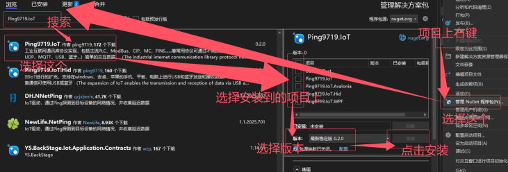


## Ping9719.IoT   
工业互联网通讯库协议实现，包括主流协议：ModBus、S7、CIP、MC、FINS......等常用协议和PLC。可通过不同的方式：TCP、UDP、MQTT、USB、蓝牙...等进行简易方便的交换数据。

## 语言选择：
[简体中文](README.md) || [English](README_en-US.md) 

## 仓库：
主库（[Github](https://github.com/ping9719/IoT)）；备库（[Gitee](https://gitee.com/ping9719/IoT)） 
 

## 项目引导 <a id="Project"></a>  

文档引导：

| 项目     |  框架                      | 文档                                      | 版本                                     |依赖                  |包名（NuGet）                  |
|----------|----------------------------|-----------------------------------------------|----------------------------------------------|----------------------|-----------------------------|
| Ping9719.IoT      | net45;</br>netstandard2.0  | [文档](Ping9719.IoT/docs/README.md)           |[文档](Ping9719.IoT/docs/VERSION.md)          | System.IO.Ports      |Ping9719.IoT                 |
| Ping9719.IoT.Hid      | net45;</br>netstandard2.0  | [文档](Ping9719.IoT.Hid/docs/README.md)       |[文档](Ping9719.IoT.Hid/docs/VERSION.md)      | IoT;</br>HidSharp    |Ping9719.IoT.Hid             | 
| Ping9719.IoT.WPF      | net45;</br>net8.0-windows  | [文档](Ping9719.IoT.WPF/docs/README.md)       |[文档](Ping9719.IoT.WPF/docs/VERSION.md)      | IoT;                 |Ping9719.IoT.WPF </br>(暂未发布)   | 
| Ping9719.IoT.Avalonia | net8.0;</br>netstandard2.0 | [文档](Ping9719.IoT.Avalonia/docs/README.md)  |[文档](Ping9719.IoT.Avalonia/docs/VERSION.md) | IoT;</br>Avalonia    |Ping9719.IoT.Avalonia </br>(暂未发布) | 

介绍引导：

| 项目     |  介绍                      | 
|----------|----------------------------|
| Ping9719.IoT      | 跨平台的库。包含基础、通信(TCP，UDP，串口... )、协议(ModBus，MC，FINS... )、算法(CRC，LRC...)、设备控制|
| Ping9719.IoT.Hid      |跨平台库。对IoT进行的扩充，支持在windows、安卓、苹果的手机、平板、电脑上进行USB和蓝牙发送和接收数据 |
| Ping9719.IoT.WPF      |在windows平台上的界面UI库。提供众多方便可直接使用的控件可快速调试IoT中的各种协议和设备|
| Ping9719.IoT.Avalonia |跨平台的界面UI库。提供众多方便可直接使用的控件可快速调试IoT中的各种协议和设备 |

安装引导：



## 项目亮点介绍 
> 这里是亮点项目介绍，不是详细文档！！！详细文档在上面的“项目引导”中。   
> 假如你还是找不到，你可以点击：（[跳转到项目引导](#Project)）（[跳转到IoT详细文档](Ping9719.IoT/docs/README.md)）

1.<b>常用协议</b>实现 `IReadWrite`，可通过泛型方式进行读或写。  
```CSharp
client.Read<bool>("abc");//读1个
client.Read<bool>("abc", 5);//读5个
client.Write<bool>("abc", true);//写1个
client.Write<int>("abc", new int[] { 10, 20, 30 });//写多个
```

2.<b>所有客户端协议</b>可快速的切换为不同的方式，比如从`TCP`切换为`USB` 
> 这里以`ModbusRtu`举列，默认只支持串口。但是如果你想实现`ModbusRtuOverTcpClient`（使用TCP的方式走`ModbusRtu`协议）其他的都是同理。 

```CSharp
var serialPortClient = new SerialPortClient("COM1", 9600);
var tcpClient = new TcpClient("127.0.0.1", 502);
var usbHidClient = new UsbHidClient(UsbHidClient.GetNames[0]);

var client0 = new ModbusRtuClient(serialPortClient);//使用串口方式，默认 
var client1 = new ModbusRtuClient(tcpClient);//使用Tcp方式，ModbusRtuOverTcpClient
var client2 = new ModbusRtuClient(usbHidClient);//使用Usb方式，ModbusRtuOverUsbClient
client0.Client.Open();//打开
```

3.客户端`ClientBase`包含丰富的功能，且代码一致性高。   
>以下代码所有通用，包含 `TcpClient`、`SerialPortClient`、`UsbHidClient` 等...
```CSharp
ClientBase client1 = new TcpClient("127.0.0.1", 502);//Tcp方式
client1.Encoding = Encoding.UTF8;

//1：连接模式。断线重连使用得比较多
client1.ConnectionMode = ConnectionMode.Manual;//手动。需要自己去打开和关闭，此方式比较灵活。
client1.ConnectionMode = ConnectionMode.AutoOpen;//自动打开。没有执行Open()时每次发送和接收会自动打开和关闭，比较合适需要短链接的场景，如需要临时的长链接也可以调用Open()后在Close()。
client1.ConnectionMode = ConnectionMode.AutoReconnection;//自动断线重连。在执行了Open()后，如果检测到断开后会自动打开，比较合适需要长链接的场景。调用Close()将不再重连。

//2：接收模式。以您以为的最好的方式来处理粘包问题
client1.ReceiveMode = ReceiveMode.ParseByteAll();
client1.ReceiveModeReceived = ReceiveMode.ParseByteAll();

//3：数据处理器。可在发送时加入换行，接收时去掉换行，也可自定义
client1.SendDataProcessors.Add(new EndAddValueDataProcessor("\r\n", client1.Encoding));
client1.ReceivedDataProcessors.Add(new EndClearValueDataProcessor("\r\n", client1.Encoding));

//4：事件驱动。
client1.Opened = (a) => { Console.WriteLine("链接成功。"); };
client1.Closed = (a, b) => { Console.WriteLine($"关闭成功。{(b ? "手动断开" : "自动断开")}"); };
client1.Received = (a, b) => { Console.WriteLine($"收到消息：{a.Encoding.GetString(b)}"); };

client1.Open();//打开，在打开前处理属性和事件

//5：简单的发送、接收和发送等待操作。 
client1.Send("abc");//发送
client1.Receive();//接收
client1.Receive(3000);//接收，3秒超时
client1.Receive(ReceiveMode.ParseToEnd("\n", 3000));//接收\n字符串结尾的，超时为3秒 
client1.SendReceive("abc", 3000);//发送并等待接收数据，3秒超时
client1.SendReceive("abc", ReceiveMode.ParseToEnd("\n", 3000));//发送并接收\n字符串结尾的，超时为3秒 
```

4.返回类型统一为 `IoTResult`，不需要在单独使用`Try`来处理异常信息。
> `IoTResult<T>`包含`Value`，`IoTResult`不包含 
```CSharp
var info = client.Read<bool>("abc");
if (info.IsSucceed)//应判断后在取值
   var val = info.Value;
else
   var err = info.ErrorText;
```