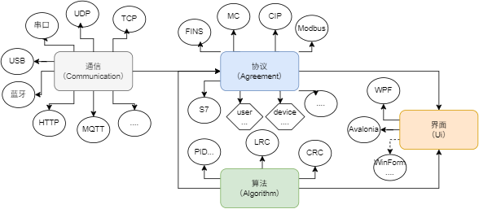

## Ping9719.IoT
Industrial Internet Communication Library Protocol Implementation, including mainstream protocols: ModBus, S7, CIP, MC, FINS... and other common protocols and PLCs. Data can be easily exchanged via different methods: TCP, UDP, MQTT, USB, Bluetooth...

### Language Selection:
[简体中文](README.md) || [English](README_en-US.md)

### Open Source Code:
Main Repository: [Github](https://github.com/ping9719/IoT)   
Backup Repository: [Gitee](https://gitee.com/ping9719/IoT)

### Documentation Entry: <a id="DocMain"></a>
Go to detailed documentation here: [Click to Enter Documentation](Ping9719.IoT/docs/README.md) || [Click to Enter Version Documentation](Ping9719.IoT/docs/VERSION.md)

### Project Framework Diagram:


## How to Install?


## Package Name & Introduction:

| Package Name (NuGet)         |  Environment                          |  Introduction                      |
|-----------------------|-------------------------				|----------------------------|
| Ping9719.IoT          | net45 ; netstandard2.0            	|Cross-platform library. Contains basics, communication (TCP, UDP, Serial Port...), protocols (ModBus, MC, FINS...), algorithms (CRC, LRC...), device control|
| Ping9719.IoT.Hid      | net45 ; netstandard2.0        		|Cross-platform library. Extension of IoT, supports USB and Bluetooth data transmission and reception on Windows, Android, Apple phones, tablets, and computers |
| Ping9719.IoT.WPF</br>(Not yet released)      | net45 ; net8.0-windows |UI library for the Windows platform. Provides numerous convenient, ready-to-use controls for quickly debugging various protocols and devices in IoT|
| Ping9719.IoT.Avalonia</br>(Not yet released) | net8.0 ; netstandard2.0|Cross-platform UI library. Provides numerous convenient, ready-to-use controls for quickly debugging various protocols and devices in IoT |

## Highlights Introduction:
> Here are the project highlights, not the detailed documentation!!! Detailed documentation is in the "Documentation Entry" above.   
> If you cannot find it, you can click: ([Jump to Documentation Entry](#DocMain))([Jump to IoT Documentation](Ping9719.IoT/docs/README.md))

1. Common protocol implementations of `IReadWrite` allow reading or writing via generic methods.
```CSharp
client.Read<bool>("abc"); // Read 1
client.Read<bool>("abc", 5); // Read 5
client.Write<bool>("abc", true); // Write 1
client.Write<int>("abc", new int[] { 10, 20, 30 }); // Write multiple
```

2. All client protocols can quickly switch between different methods, such as from `TCP` to `USB`
> Here, `ModbusRtu` is used as an example. By default, it only supports serial port. But if you want to implement `ModbusRtuOverTcpClient` (using TCP for `ModbusRtu` protocol), the principle is the same for others.

```CSharp
var serialPortClient = new SerialPortClient("COM1", 9600);
var tcpClient = new TcpClient("127.0.0.1", 502);
var usbHidClient = new UsbHidClient(UsbHidClient.GetNames[0]);

var client0 = new ModbusRtuClient(serialPortClient); // Using serial port, default
var client1 = new ModbusRtuClient(tcpClient); // Using Tcp, ModbusRtuOverTcpClient
var client2 = new ModbusRtuClient(usbHidClient); // Using Usb, ModbusRtuOverUsbClient
client0.Client.Open(); // Open
```

3. The client `ClientBase` includes rich features and maintains high code consistency.
> The following code is universal, including `TcpClient`, `SerialPortClient`, `UsbHidClient`, etc...
```CSharp
ClientBase client1 = new TcpClient("127.0.0.1", 502); // Tcp method
client1.Encoding = Encoding.UTF8;

// 1: Connection Mode. Auto-reconnection is commonly used.
client1.ConnectionMode = ConnectionMode.Manual; // Manual. You need to open and close it yourself. This mode is more flexible.
client1.ConnectionMode = ConnectionMode.AutoOpen; // Auto-open. If Open() is not executed, it will automatically open and close for each send/receive, suitable for short connection scenarios. For temporary long connections, call Open() followed by Close().
client1.ConnectionMode = ConnectionMode.AutoReconnection; // Auto-reconnection. After Open() is called, if a disconnection is detected, it will automatically reopen, suitable for long connection scenarios. Calling Close() will stop reconnection.

// 2: Receive Mode. Handles packet sticking in the way you think is best.
client1.ReceiveMode = ReceiveMode.ParseByteAll();
client1.ReceiveModeReceived = ReceiveMode.ParseByteAll();

// 3: Data Processors. Can add line breaks when sending, remove them when receiving, or customize.
client1.SendDataProcessors.Add(new EndAddValueDataProcessor("\r\n", client1.Encoding));
client1.ReceivedDataProcessors.Add(new EndClearValueDataProcessor("\r\n", client1.Encoding));

// 4: Event-driven.
client1.Opened = (a) => { Console.WriteLine("Connection successful."); };
client1.Closed = (a, b) => { Console.WriteLine($"Closed successfully. {(b ? "Manually disconnected" : "Automatically disconnected")}"); };
client1.Received = (a, b) => { Console.WriteLine($"Received message: {a.Encoding.GetString(b)}"); };

client1.Open(); // Open, handle properties and events before opening

// 5: Simple send, receive, and send-receive operations.
client1.Send("abc"); // Send
client1.Receive(); // Receive
client1.Receive(3000); // Receive, 3-second timeout
client1.Receive(ReceiveMode.ParseToEnd("\n", 3000)); // Receive until "\n" string, 3-second timeout
client1.SendReceive("abc", 3000); // Send and wait for data, 3-second timeout
client1.SendReceive("abc", ReceiveMode.ParseToEnd("\n", 3000)); // Send and receive until "\n" string, 3-second timeout
```

4. The return type is unified as `IoTResult`, eliminating the need for separate `Try` blocks to handle exceptions.
> `IoTResult<T>` contains `Value`, while `IoTResult` does not.
```CSharp
var info = client.Read<bool>("abc");
if (info.IsSucceed) // Should check before getting the value
   var val = info.Value;
else
   var err = info.ErrorText;
```