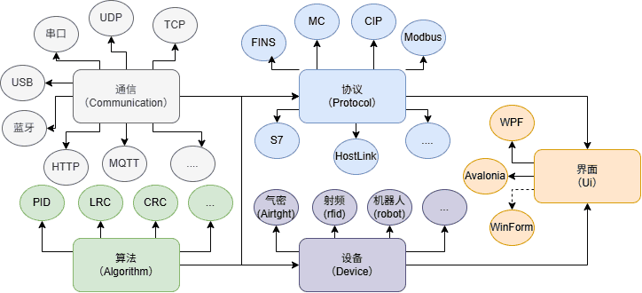
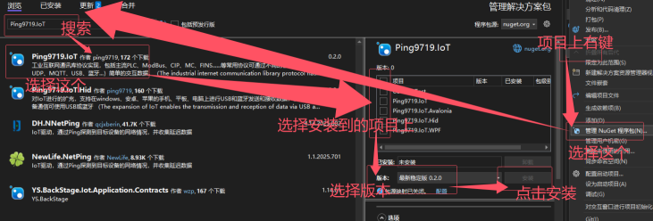

## 
## Ping9719.IoT   
This is an industrial communication library. It includes mainstream communication methods (TCP, UDP, MQTT, USB, Bluetooth...) and mainstream communication protocols (ModBus, S7, CIP, MC, FINS...). It is simple and convenient to use out of the box.

### Language Selection
[简体中文](README.md) || [English](README_en-US.md)    

### Open Source Code
Main repository: [Github](https://github.com/ping9719/IoT)   
Backup repository: [Gitee](https://gitee.com/ping9719/IoT)    

### Documentation Entry <a id="DocMain"></a>
Enter detailed documentation from here: [Click me to enter documentation](Ping9719.IoT/docs/README.md) || [Click me to enter version documentation](Ping9719.IoT/docs/VERSION.md)

### Project Framework Diagram


## How to Install?


## Package Names & Descriptions

| Package Name (NuGet)         |  Environment                            		|  Description                      | 
|-----------------------|---------------------------------------|----------------------------|
| Ping9719.IoT          | net45 ; netstandard2.0 ; net8.0     	|Industrial communication library. Includes basic communication methods, communication protocols, common algorithms, and common device protocols|
| Ping9719.IoT.Hid      | net45 ; netstandard2.0 ; net8.0       |Hid extension library. Includes less common communication methods (USB, Bluetooth, serial port) |
| Ping9719.IoT.WPF</br>(Not yet released)      | net45 ; net8.0-windows |Controls library. Controls implemented for communication methods, communication protocols, and common algorithms|
| Ping9719.IoT.Avalonia</br>(Not yet released) | net8.0 ; netstandard2.0|Controls library. Controls implemented for communication methods, communication protocols, and common algorithms| 

## Four Highlights
> This is an introduction to project highlights, not detailed documentation!!! Detailed documentation is in the "Documentation Entry" above.   
> If you cannot find it, you can click: ([Jump to Documentation Entry](#DocMain)) ([Jump to IoT documentation](Ping9719.IoT/docs/README.md))

### One: <b>Common protocols</b> implement `IClientData` or `IReadWrite`, and can read or write through generics.  
```CSharp
client.Read<bool>("abc");// Read 1
client.Read<bool>("abc", 5);// Read 5
client.Write<bool>("abc", true);// Write 1
client.Write<int>("abc", new int[] { 10, 20, 30 });// Write multiple
```

### Two: <b>All client protocols</b> can be quickly switched to different methods, for example, from `TCP` to `USB`.
> Here `ModbusRtu` is used as an example; by default it only supports serial port. But if you want to implement `ModbusRtuOverTcpClient` (using TCP to run the `ModbusRtu` protocol), the same applies to others.

```CSharp
var serialPortClient = new SerialPortClient("COM1", 9600);
var tcpClient = new TcpClient("127.0.0.1", 502);
var usbHidClient = new UsbHidClient(UsbHidClient.GetNames[0]);

var client0 = new ModbusRtuClient(serialPortClient);// Use serial port mode, default
var client1 = new ModbusRtuClient(tcpClient);// Use Tcp mode, ModbusRtuOverTcpClient
var client2 = new ModbusRtuClient(usbHidClient);// Use Usb mode, ModbusRtuOverUsbClient
client0.Client.Open();// Open
```

### Three: Client `ClientBase` contains rich features and has high code consistency.   
> The following code is common to all, including `TcpClient`, `SerialPortClient`, `UsbHidClient`, etc...
```CSharp
ClientBase client1 = new TcpClient("127.0.0.1", 502);// Tcp mode
client1.Encoding = Encoding.UTF8;

//1: Connection mode. Auto-reconnection is used more often
client1.ConnectionMode = ConnectionMode.Manual;// Manual. You need to open and close it yourself; this method is more flexible.
client1.ConnectionMode = ConnectionMode.AutoOpen;// Auto open. If Open() is not called, each send and receive automatically opens and closes. Suitable for short connection scenarios. If a temporary long connection is needed, you can also call Open() then Close().
client1.ConnectionMode = ConnectionMode.AutoReconnection;// Auto reconnection. After Open() is called, if disconnection is detected, it automatically opens. Suitable for long connection scenarios. Calling Close() will stop reconnecting.

//2: Receive mode. Handle sticky packets in the way you think is best
client1.ReceiveMode = ReceiveMode.ParseByteAll();
client1.ReceiveModeReceived = ReceiveMode.ParseByteAll();

//3: Data processors. Can add a newline when sending and remove it when receiving; can also be customized
client1.SendDataProcessors.Add(new EndAddValueDataProcessor("\r\n", client1.Encoding));
client1.ReceivedDataProcessors.Add(new EndClearValueDataProcessor("\r\n", client1.Encoding));

//4: Event-driven.
client1.Opened += (a) => { Console.WriteLine("Connection succeeded."); };
client1.Closed += (a, b) => { Console.WriteLine($"Closed successfully. Close code: {b}"); };
client1.Received += (a, b) => { Console.WriteLine($"Message received: {a.Encoding.GetString(b)}"); };

client1.Open();// Open; process properties and events before opening

//5: Simple send, receive, and send-wait operations. 
client1.Send("abc");// Send
client1.Receive();// Receive
client1.Receive(3000);// Receive, 3-second timeout
client1.Receive(ReceiveMode.ParseToEnd("\n", 3000));// Receive until the \n string ending, timeout 3 seconds 
client1.SendReceive("abc", 3000);// Send and wait to receive data, 3-second timeout
client1.SendReceive("abc", ReceiveMode.ParseToEnd("\n", 3000));// Send and receive until the \n string ending, timeout 3 seconds 
```

### Four: The return type is unified as `IoTResult`, so there is no longer a need to use `Try` separately to handle exception information.
> `IoTResult<T>` contains `Value`; `IoTResult` does not.
```CSharp
var info = client.Read<bool>("abc");
if (info.IsSucceed)// Should check before getting the value
   var val = info.Value;
else
   var err = info.ErrorText;
```