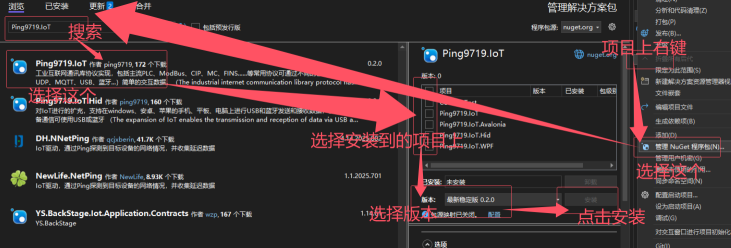

## Ping9719.IoT  
An industrial internet communication library implementing mainstream protocols such as ModBus, S7, CIP, MC, FINS, and other commonly used protocols and PLCs. It enables simple and convenient data exchange through various methods including TCP, UDP, MQTT, USB, Bluetooth, etc.

## Language:
[简体中文](README.md) || [English](README_en-US.md) 

## Repository:
Primary: ([Github](https://github.com/ping9719/IoT)); Mirror: ([Gitee](https://gitee.com/ping9719/IoT)) 

## Projects:

| Project |  Supported Frameworks | Documentation | Version | Dependencies | Package Name (NuGet) |
|----------|----------------------------|------------------------------------------------|------------------------------------------------|----------------------|-----------------------------|
| [Ping9719.IoT](#IoT) | net45;</br>netstandard2.0 | [Documentation](Ping9719.IoT/docs/README.md) | [Version](Ping9719.IoT/docs/VERSION.md) | System.IO.Ports | Ping9719.IoT |
| [Ping9719.IoT.Hid](#Hid) | net45;</br>netstandard2.0 | [Documentation](Ping9719.IoT.Hid/docs/README.md) | [Version](Ping9719.IoT.Hid/docs/VERSION.md) | IoT;</br>HidSharp | Ping9719.IoT.Hid |
| [Ping9719.IoT.WPF](#WPF) | net45;</br>net8.0-windows | [Documentation](Ping9719.IoT.WPF/docs/README.md) | [Version](Ping9719.IoT.WPF/docs/VERSION.md) | IoT; | Ping9719.IoT.WPF </br>(Not yet released) |
| [Ping9719.IoT.Avalonia](#Avalonia) | net8.0;</br>netstandard2.0 | [Documentation](Ping9719.IoT.Avalonia/docs/README.md) | [Version](Ping9719.IoT.Avalonia/docs/VERSION.md) | IoT;</br>Avalonia | Ping9719.IoT.Avalonia </br>(Not yet released) |


### Ping9719.IoT <a id="IoT"></a>
> A cross-platform library.  
Core: Interface definitions, return type definitions...  
Communication: TCP, UDP, Serial Port...  
Protocols: ModBus, MC, FINS...  
Algorithms: CRC, LRC...  
Devices: RFID, Barcode Scanner...  

### Ping9719.IoT.Hid <a id="Hid"></a>
> A cross-platform library extension.  
Extends IoT to support USB and Bluetooth data transmission and reception on Windows, Android, and Apple phones, tablets, and computers.

### Ping9719.IoT.WPF <a id="WPF"></a>
> A UI library for Windows platform.  
Provides numerous convenient, ready-to-use controls for quickly debugging various protocols and devices in IoT.

### Ping9719.IoT.Avalonia <a id="Avalonia"></a>
> A cross-platform UI library.  
Provides numerous convenient, ready-to-use controls for quickly debugging various protocols and devices in IoT.

## How to Install the Package


## Introduction, Getting Started, Highlights
1. <b>Common protocols</b> implement `IReadWrite`, enabling read/write operations via generics.  
```CSharp
client.Read<bool>("abc");// read 1
client.Read<bool>("abc", 5);// read 5
client.Write<bool>("abc", true);// write 1
client.Write<int>("abc", 10, 20, 30);// write multiple
client.Write<int>("abc", new int[] { 10, 20, 30 });// write multiple
```

2. <b>All client protocols</b> can be quickly switched to different transport methods, for example, from `TCP` to `USB`.  
> Taking `ModbusRtu` as an example, it only supports serial port by default. However, you can implement `ModbusRtuOverTcpClient` (using TCP to carry the `ModbusRtu` protocol). The same principle applies to other protocols. 

```CSharp
var client0 = new ModbusRtuClient("COM1");// using serial port, default
var client1 = new ModbusRtuClient(new TcpClient("127.0.0.1", 502));// using TCP, ModbusRtuOverTcpClient
var client2 = new ModbusRtuClient(new UsbHidClient("xxxxx001"));// using USB, ModbusRtuOverUsbClient
client1.Client.Open();// open
```

3. The base client `ClientBase` contains rich functionality with high code consistency.   
【Tip】The following code is universally applicable to `TcpClient`, `SerialPortClient`, `UsbHidClient`, etc.
```CSharp
ClientBase client1 = new TcpClient("127.0.0.1", 502);// TCP mode
client1.Encoding = Encoding.UTF8;

// 1: Connection mode. Often used for auto-reconnection after disconnection.
client1.ConnectionMode = ConnectionMode.Manual;// Manual. You need to open and close it yourself. This method is more flexible.
client1.ConnectionMode = ConnectionMode.AutoOpen;// Auto open. If Open() hasn't been called, it will automatically open and close on every send/receive. Suitable for short-connection scenarios. For temporary long connections, you can call Open() then Close().
client1.ConnectionMode = ConnectionMode.AutoReconnection;// Auto reconnect. After calling Open(), if a disconnection is detected, it will automatically reconnect. Suitable for long-connection scenarios. Calling Close() will stop reconnection attempts.

// 2: Receive mode. Handle packet sticking issues in the way you prefer.
client.ReceiveMode = ReceiveMode.ParseByteAll();
client.ReceiveModeReceived = ReceiveMode.ParseByteAll();

// 3: Data processors. You can add line breaks when sending and remove them when receiving, or define custom processors.
client1.SendDataProcessors.Add(new EndAddValueDataProcessor("\r\n", client1.Encoding));
client1.ReceivedDataProcessors.Add(new EndClearValueDataProcessor("\r\n", client1.Encoding));

// 4: Event-driven.
client1.Opened = (a) => { Console.WriteLine("Connected successfully."); };
client1.Closed = (a, b) => { Console.WriteLine($"Closed successfully. {(b ? "Manually disconnected" : "Automatically disconnected")}"); };
client1.Received = (a, b) => { Console.WriteLine($"Received message: {a.Encoding.GetString(b)}"); };

client1.Open();// Open. Set properties and events before opening.

// 5: Simple send, receive, and send-then-wait operations.
client1.Send("abc");// send
client1.Receive();// receive
client1.Receive(3000);// receive, 3-second timeout
client1.Receive(ReceiveMode.ParseToEnd("\n", 3000));// receive string ending with \n, 3-second timeout
client1.SendReceive("abc", 3000);// send and wait for response, 3-second timeout
client1.SendReceive("abc", ReceiveMode.ParseToEnd("\n", 3000));// send and wait for string ending with \n, 3-second timeout
```

4. Unified return type `IoTResult`, eliminating the need to use `Try` patterns separately for exception handling.  
> `IoTResult<T>` contains `Value`, `IoTResult` does not. 
```CSharp
var info = client.Read<bool>("abc");
if (info.IsSucceed)// should check before accessing value
   var val = info.Value;
else
   var err = info.ErrorText;
```